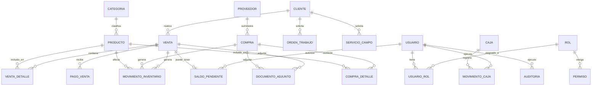
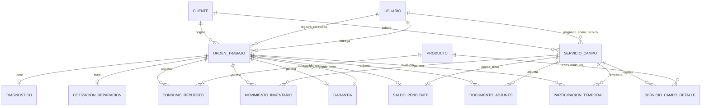

# Conceptual-Data-Model.md — Modelo Conceptual de Datos

## 1. Propósito

Presenta el modelo conceptual de datos de ISARMIN ERP: las entidades del negocio, sus atributos principales y las relaciones entre ellas, **sin decisiones de implementación** (motor de base de datos, claves técnicas, índices, normalización física). Es el puente entre `Functional-Requirements.md` / `Use-Cases.md` (qué hace el sistema) y el futuro Modelo Entidad-Relación físico de `04-Database/` (cómo se almacena).

Cada entidad y relación aquí definida se deriva de un Requerimiento Funcional o Regla de Negocio ya confirmado — no se inventa ninguna estructura de datos nueva.

## 2. Convención

**[C]** Confirmado · **[I]** Inferido · **[PV]** Pendiente de Validación — igual que en el resto de la documentación. El detalle de campos por entidad está en [Data-Dictionary.md](Data-Dictionary.md).

## 3. Decisiones de modelado explícitas (para que la fase de Arquitectura no las repita a ciegas)

Estas son interpretaciones del analista sobre **cómo estructurar** información ya confirmada, no reglas de negocio nuevas. Se marcan aparte porque la fase de Arquitectura deberá confirmarlas o ajustarlas:

1. **Saldo Pendiente como entidad transversal** (`SaldoPendiente`): dado que RN-001/RN-031 permiten saldo pendiente autorizado en Ventas, OT y Servicios de Campo por igual, se modela una única entidad transversal en lugar de repetir los mismos campos en tres tablas. **Directriz confirmada para la fase de Arquitectura (2026-07-18):** evitar herencia (TPH/TPT) o polimorfismo complejo; priorizar una solución simple y mantenible, compatible con PostgreSQL/Entity Framework Core — por ejemplo, tres claves foráneas opcionales (`VentaId`, `OrdenTrabajoId`, `ServicioCampoId`), exactamente una no nula por registro. La forma exacta de garantizar esa exclusividad (restricción a nivel de base de datos vs. validación a nivel de aplicación) queda como decisión de la fase de Arquitectura, no de este documento.
2. **Movimiento de Inventario como entidad transversal** (`MovimientoInventario`, el Kardex): un único registro de movimientos con un campo "motivo" (catálogo CAT-013: Compra, Venta, Consumo en Taller, Consumo en Campo, Ajuste, Devolución) y una referencia a su origen, en vez de duplicar la lógica de descuento de stock en cada módulo.
3. **Documento Adjunto y Auditoría como entidades transversales**, cada una con referencia genérica a la entidad que documentan/auditan (Venta, Compra, OrdenTrabajo, ServicioCampo).
4. **Usuario–Rol como relación N:M** (tabla `UsuarioRol`), no 1:N, para no bloquear a futuro la posibilidad de multi-rol (BQ-042, parcialmente resuelta — hoy no es necesario, pero no cuesta modelarlo flexible desde el inicio).
5. **Participación de Trabajador Temporal** como dato de referencia (no un actor con cuenta), asociado a una OT o Servicio de Campo (RN-027, RF-090).
6. **Código de producto** (2026-07-18): el registro de productos en V1 es manual; cada producto tiene un **código interno obligatorio** y un **código de barras comercial opcional** — el campo debe existir desde el inicio aunque la lectura por escáner no sea obligatoria en V1 (BQ-056 resuelta).

> **Nota:** el mismo principio de simplicidad aplicado a `SaldoPendiente` (decisión #1) debería evaluarse análogamente para `MovimientoInventario`, `MovimientoCaja`, `DocumentoAdjunto` y `Auditoria` durante la fase de Arquitectura — no se asume aquí, queda como pregunta a resolver en ese momento.

## 4. Diagrama conceptual — Núcleo Comercial (Usuarios, Clientes, Inventario, Compras, Ventas, Caja)

## 5. Diagrama conceptual — Núcleo Técnico (Taller, Servicios de Campo, Garantías)

## 6. Catálogo de entidades

| Entidad | Descripción | Estado | Origen (RF/RN) |
|---|---|---|---|
| **Usuario** | Persona con acceso al sistema (Administrador, Ventas, Técnico). | [C] | RF-001, Actors.md |
| **Rol** | Conjunto configurable de permisos (RN-028). | [C] | RF-008 |
| **Permiso** | Combinación módulo + acción habilitada para un Rol. | [C] | RF-010 |
| **UsuarioRol** | Asociación N:M entre Usuario y Rol (ver decisión de modelado #4). | [PV] | BQ-042 |
| **Cliente** | Persona natural o jurídica que compra, repara o contrata servicios. Baja lógica únicamente (RN-023). | [C] | RF-012 |
| **Proveedor** | Empresa/persona que suministra productos. | [I] | RF-018 |
| **Categoria** | Clasificación de productos (CAT-002). | [C] (valores) / [PV] (jerarquía) | RF-025 |
| **Producto** | Ítem del inventario único y compartido (RN-006). Atributos: código, nombre, categoría, marca, unidad de medida, costo, precio, margen, stock. | [C] | RF-023 |
| **MovimientoInventario** | Kardex: cada entrada/salida de stock, con motivo (CAT-013) y referencia a su origen. | [C] | RN-002, RF-027 |
| **Compra** | Registro de una compra directa a un proveedor (sin OC formal, RN-024). | [C] | RF-033 |
| **CompraDetalle** | Línea de producto dentro de una Compra (cantidad, costo unitario). | [C] | RF-033 |
| **Venta** | Comprobante de venta (cotización, boleta, factura, nota de venta o ticket). | [C] | RF-038 |
| **VentaDetalle** | Línea de producto dentro de una Venta. | [I] | RF-038 |
| **PagoVenta** | Un medio de pago aplicado a una Venta (permite pagos combinados). | [PV] | BQ-012 (medios confirmados; combinación de varios en una venta: sin confirmar) |
| **SaldoPendiente** | Entidad transversal: monto pendiente autorizado por el Administrador, asociado a una Venta, OrdenTrabajo o ServicioCampo. | [C] | RN-001, RN-031, BQ-093 |
| **Caja** | Caja única del negocio (RN-025). | [C] | RF-046 |
| **MovimientoCaja** | Ingreso o egreso de Caja, vinculado a su origen (venta, cobro de OT/servicio, compra, gasto). | [I] | RF-047 |
| **OrdenTrabajo (OT)** | Registro de una reparación, desde la recepción hasta la entrega. Pertenece siempre a un Cliente (RN-004). | [C] | RF-051 |
| **Diagnostico** | Evaluación técnica de la falla, asociada 1:1 a una OT. | [I] | RF-054 |
| **CotizacionReparacion** | Costo estimado de la reparación, asociada a una OT. | [I] | RF-055 |
| **ConsumoRepuesto** | Línea de producto (repuesto) consumido en una OT. | [C] | RF-057 |
| **Garantia** | Período de cobertura (inicio/fin) asociado a una OT cerrada. Alcance V1 acotado — sin tipos ni condiciones de cobertura (RN-017). | [C] | RF-061 |
| **ServicioCampo** | Solicitud y ejecución de un trabajo fuera del local. Pertenece a un Cliente. | [C] | RF-064 |
| **ServicioCampoDetalle** | Línea de material/repuesto consumido en un Servicio de Campo. | [C] | RF-067 |
| **ParticipacionTemporal** | Referencia a un trabajador temporal (ayudante) que participó en una OT o Servicio de Campo, sin cuenta de usuario. | [C] | RF-090, RN-027 |
| **DocumentoAdjunto** | Archivo (foto, documento de compra, cotización, comprobante, informe técnico) asociado a una Venta, Compra, OT o Servicio de Campo. | [C] | RF-084 a RF-087 |
| **Auditoria** | Bitácora transversal: usuario, fecha, hora, acción, entidad afectada. | [C] | RF-078, RF-079 |

## 7. Relaciones clave y su regla de negocio asociada

| Relación | Cardinalidad | Regla de negocio |
|---|---|---|
| Producto — MovimientoInventario | 1:N | RN-002 (todo movimiento debe quedar registrado) |
| Cliente — OrdenTrabajo | 1:N | RN-004 (una OT debe pertenecer a un cliente) |
| OrdenTrabajo — Garantia | 1:0..1 (emite) / N:1 (reingresa) | RN-017 |
| Venta / OrdenTrabajo / ServicioCampo — SaldoPendiente | 1:0..1 | RN-001, RN-031 (requiere autorización del Administrador) |
| Usuario — Auditoria | 1:N | RN-022 (toda acción crítica queda asociada a un usuario) |
| Cliente (baja lógica) | — | RN-023 (nunca eliminación física si tiene historial) |

## 8. Lo que este modelo NO resuelve todavía (correcto que no lo haga en esta fase)

- Tipos de dato físicos, claves primarias/foráneas técnicas, índices — corresponden a `04-Database/`.
- Método definitivo de valorización de inventario (RN-013, tentativo: costo promedio ponderado) — afecta cómo se calcula el costo en `MovimientoInventario`, pero no la estructura conceptual.
- Estructura exacta de `PagoVenta` si se confirma que una venta admite múltiples medios de pago combinados (BQ-012 confirmó los medios, no la combinación).
- Volumetría (BQ-069) — irrelevante para el modelo conceptual, relevante para el diseño físico/índices.

## 9. Siguiente paso

Ver [Data-Dictionary.md](Data-Dictionary.md) para el detalle de atributos por entidad, insumo directo para el Modelo Entidad-Relación físico de la fase de Arquitectura.
