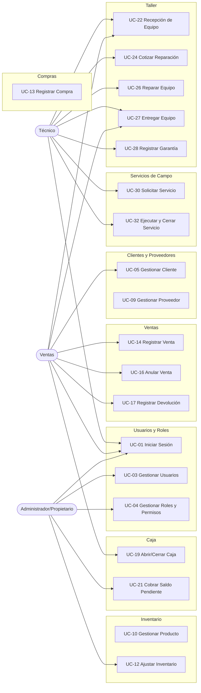

# Use-Cases.md — Casos de Uso (UML)

## 1. Propósito

Especifica los Casos de Uso del sistema siguiendo la notación de **UML Use Case Diagrams** y la plantilla estándar de especificación (Cockburn/RUP: actor, precondición, flujo principal, flujos alternativos, postcondición). Es el puente directo entre `Functional-Requirements.md` / `Business-Workflows.md` (qué hace el sistema) y el futuro diseño de arquitectura (cómo se construye), tal como exige `PROJECT_CONTEXT.md` antes de iniciar esa fase.

Cada caso de uso referencia los Requerimientos Funcionales (RF-XXX) y Reglas de Negocio (RN-XXX) de los que se deriva — no se inventa ningún comportamiento nuevo aquí, solo se formaliza lo ya validado con el propietario.

## 2. Convención

| Marca | Significado |
|---|---|
| **[C]** | El flujo del caso de uso está confirmado por el propietario. |
| **[I]** | El flujo se infiere razonablemente de RF/RN ya confirmados. |
| **[PV]** | El flujo contiene al menos un paso aún pendiente de validación (referenciado con su BQ-XXX). |

## 3. Actores

Ver [Actors.md](Actors.md) para el detalle completo. Resumen:
- **Administrador/Propietario** — acceso completo.
- **Ventas** — atención al cliente, ventas, caja, consulta de inventario, recepción/entrega de equipos (configurable).
- **Técnico** — taller, diagnósticos, órdenes de trabajo, consumo de materiales, servicios de campo, recepción/entrega de equipos (configurable).
- **Cliente** — actor externo, no interactúa directamente con el sistema (sin acceso, BQ-006 resuelta); aparece en los casos de uso como quien origina la solicitud o decide (aprobar/rechazar), pero la acción sobre el sistema siempre la ejecuta un usuario interno.

## 4. Diagrama de Casos de Uso (por módulo)

---

## 5. Usuarios, Roles y Autenticación

### UC-01 — Iniciar Sesión
- **Actor:** Administrador, Ventas, Técnico.
- **Estado:** [I] — RF-004.
- **Precondición:** El usuario tiene una cuenta activa (no desactivada, RN-021).
- **Flujo principal:** 1) El usuario ingresa sus credenciales. 2) El sistema valida usuario/contraseña. 3) El sistema determina el rol y los permisos asociados (RF-011). 4) El sistema muestra los módulos habilitados para ese rol.
- **Flujo alternativo:** 2a) Credenciales inválidas → el sistema rechaza el acceso (política exacta de bloqueo tras intentos fallidos: **BQ-047**, pendiente).
- **Postcondición:** Sesión iniciada; toda acción subsecuente queda asociada a este usuario (RN-022).

### UC-02 — Cerrar Sesión
- **Actor:** Administrador, Ventas, Técnico. **Estado:** [I] — RF-005. Flujo trivial: el usuario solicita cerrar sesión; el sistema invalida el token/sesión activa.

### UC-03 — Gestionar Usuarios
- **Actor:** Administrador. **Estado:** [C] — RF-001, RF-002, RF-003.
- **Precondición:** El usuario autenticado tiene rol Administrador.
- **Flujo principal:** 1) El Administrador registra un nuevo usuario (nombre, credenciales, rol). 2) El sistema valida unicidad de credenciales. 3) El sistema crea el usuario en estado activo.
- **Flujo alternativo:** Editar datos de un usuario existente (RF-002); Desactivar un usuario — baja lógica, nunca eliminación física, preservando su historial de auditoría (RF-003, RN-021).
- **Postcondición:** Usuario creado/editado/desactivado, registrado en auditoría (RF-078).

### UC-04 — Gestionar Roles y Permisos
- **Actor:** Administrador. **Estado:** [C] — RF-008, RF-010, RN-028.
- **Precondición:** Ninguna, salvo autenticación como Administrador.
- **Flujo principal:** 1) El Administrador crea o edita un rol (nombre, descripción). 2) El Administrador asigna permisos por módulo y acción (crear, editar, eliminar, consultar, anular) — **los roles y permisos son configurables, no fijos en código** (RN-028). 3) El sistema guarda la configuración.
- **Nota de diseño:** los 3 roles reales (Administrador, Ventas, Técnico) son datos semilla, no un enum fijo — el Administrador puede crear un cuarto rol (ej. "Caja") en el futuro sin cambios de arquitectura.
- **Postcondición:** Matriz de permisos actualizada; afecta inmediatamente a los usuarios con ese rol.

---

## 6. Clientes y Proveedores

### UC-05 — Gestionar Cliente
- **Actor:** Administrador, Ventas, Técnico (recepción, RN-029). **Estado:** [C] — RF-012 a RF-017.
- **Flujo principal:** 1) Registrar cliente (nombre, documento de identidad, datos de contacto — campos exactos obligatorios: **BQ-074**, pendiente). 2) Editar cliente. 3) Buscar cliente (por nombre o documento). 4) Consultar historial del cliente (ventas, OT, servicios — RF-017, RN-005).
- **Flujo alternativo — Desactivar cliente (RF-014):** el sistema desactiva al cliente manteniendo íntegro su historial asociado; **no existe eliminación física** (RN-023, confirmado).
- **Postcondición:** Cliente disponible (o no, si desactivado) para asociarse a nuevas operaciones; su historial nunca se pierde.
- **Pendiente [PV]:** distinción persona natural/jurídica y documento de identidad exacto (**BQ-011**).

### UC-09 — Gestionar Proveedor
- **Actor:** Administrador. **Estado:** [I] — RF-018 a RF-022. Análogo a Gestionar Cliente: registrar, editar, desactivar (baja lógica), buscar, consultar historial de compras.

---

## 7. Inventario

### UC-10 — Gestionar Producto
- **Actor:** Administrador. **Estado:** [C] — RF-023 a RF-025.
- **Flujo principal:** 1) Registrar producto con código, nombre, categoría, marca, unidad de medida, costo de adquisición, precio de venta, margen y stock inicial (RF-023, confirmado). 2) Clasificar por categoría (CAT-002). 3) Editar producto.
- **Postcondición:** Producto disponible para venta, consumo en Taller o Servicio de Campo (inventario único, RN-006).

### UC-11 — Consultar Stock
- **Actor:** Administrador, Ventas, Técnico. **Estado:** [I] — RF-026. Consulta en tiempo real de la disponibilidad de un producto antes de venderlo o consumirlo.

### UC-12 — Ajustar Inventario
- **Actor:** Administrador **(exclusivo)**. **Estado:** [C] — RF-030, RN-008 (resuelta).
- **Precondición:** Situación excepcional que requiere corregir el stock calculado por el Kardex.
- **Flujo principal:** 1) El Administrador selecciona el producto. 2) Registra la cantidad de ajuste y el **motivo (obligatorio)**. 3) El sistema genera un movimiento de inventario tipo "Ajuste" (CAT-013) y actualiza el stock.
- **Regla de negocio:** el stock no puede quedar negativo en operaciones normales; este es el único mecanismo autorizado de excepción, y **solo el Administrador puede ejecutarlo** (RN-008).
- **Postcondición:** Stock corregido, movimiento auditado (RF-078).

---

## 8. Compras

### UC-13 — Registrar Compra
- **Actor:** Administrador. **Estado:** [C] — RF-033 a RF-036, RN-024.
- **Precondición:** Proveedor registrado (UC-09).
- **Flujo principal:** 1) El Administrador registra una compra ya realizada: proveedor, fecha, productos, cantidad y costo. 2) Adjunta el documento de compra (boleta/factura del proveedor — RF-034, RF-085). 3) El sistema actualiza automáticamente el stock (Kardex, movimiento "Compra") y el costo de referencia mediante costo promedio ponderado (RN-013, tentativo).
- **Nota:** **no existe** un flujo de aprobación previa ni Orden de Compra formal en V1 (RN-024) — queda como mejora futura (RF-037).
- **Postcondición:** Inventario actualizado; compra disponible para reportes (RF-036).

---

## 9. Ventas

### UC-14 — Registrar Venta
- **Actor:** Ventas. **Estado:** [C] — RF-038 a RF-041, RF-089.
- **Precondición:** Cliente identificado (puede ser genérico para venta simple); stock disponible.
- **Flujo principal:** 1) Ventas selecciona productos del inventario. 2) El sistema calcula el total. 3) El sistema valida stock disponible (RN-003, RN-007) — si no hay stock, rechaza la línea (no hay reserva previa, solo validación al confirmar). 4) Ventas determina el tipo de comprobante (cotización, boleta, factura, nota de venta o ticket — **criterio exacto: BQ-010, pendiente**). 5) Ventas registra el o los medios de pago (Efectivo, Yape, Plin, Transferencia — CAT-008). 6) El sistema emite el comprobante y descuenta el inventario (movimiento "Venta").
- **Flujo alternativo — Saldo pendiente (RF-089):** 5a) Si el cliente no paga el total, Ventas puede registrar un saldo pendiente, pero **requiere autorización del Administrador** (RN-031, igual que en Taller). El sistema registra usuario autorizante, monto pendiente y referencia de pago.
- **Flujo alternativo — Venta ligada a reparación/servicio (RF-083):** la venta puede combinar materiales + mano de obra proveniente de una OT o Servicio de Campo aprobado.
- **Postcondición:** Venta registrada, inventario actualizado, comprobante emitido, saldo pendiente registrado si corresponde.

### UC-15 — Emitir Comprobante Electrónico
- **Actor:** Sistema (automático dentro de UC-14). **Estado:** [PV] — condicionado a **BQ-050/BQ-051** (integración SUNAT diferida). Mientras no se resuelva, el comprobante se emite en el formato interno del sistema (no necesariamente electrónico ante SUNAT).

### UC-16 — Anular Venta
- **Actor:** Ventas, Administrador. **Estado:** [PV] — reglas exactas de anulación (plazo, rol autorizante) dependen de **BQ-013**. Flujo tentativo: 1) Se selecciona la venta. 2) Se registra el motivo de anulación. 3) El sistema revierte el movimiento de inventario y marca la venta como anulada, dejando registro de auditoría (RN-022).

### UC-17 — Registrar Devolución
- **Actor:** Ventas, Administrador. **Estado:** [C] — RF-091, RN-032.
- **Precondición:** Existe un comprobante de venta original.
- **Flujo principal:** 1) Se identifica el comprobante de venta original. 2) Se registra la devolución del producto. 3) El sistema genera un movimiento de inventario tipo "Devolución" (CAT-013), con trazabilidad al comprobante original.
- **Nota:** no existe un flujo complejo de gestión de devoluciones en V1 (sin estados intermedios de aprobación) — es un registro directo.

---

## 10. Caja

### UC-19 — Abrir / Cerrar Caja
- **Actor:** Ventas, Administrador. **Estado:** [C] (concepto) / [PV] (mecánica exacta) — RF-046 a RF-049, RN-014, RN-025.
- **Flujo principal (apertura):** 1) Se registra el monto inicial de apertura (**monto exacto: pendiente de detalle**). 2) La caja queda habilitada para registrar movimientos.
- **Flujo principal (cierre):** 1) El sistema calcula el monto teórico a partir de los movimientos del turno (ventas, cobros de Taller y Campo, egresos). 2) El responsable declara el monto físico contado. 3) El sistema concilia ambos montos.
- **Flujo alternativo:** Descuadre detectado → **mecanismo exacto de resolución: BQ-031, pendiente**.
- **Nota:** existe una única caja para todo el negocio (RN-025) — no hay separación por Tienda/Taller/Campo.
- **Pendiente [PV]:** separación entre dinero personal y del negocio (**BQ-088**).

### UC-20 — Registrar Movimiento de Caja
- **Actor:** Ventas, Administrador. **Estado:** [I] — RF-047. Cualquier ingreso (venta, cobro de OT, cobro de servicio de campo) o egreso (compra, gasto operativo) genera un movimiento de caja, vinculado a su origen.

### UC-21 — Cobrar Saldo Pendiente
- **Actor:** Administrador, Ventas. **Estado:** [C] — RF-088, RN-031.
- **Precondición:** Existe una OT, Venta o Servicio de Campo con saldo pendiente autorizado previamente.
- **Flujo principal:** 1) Se ubica la OT/Venta/Servicio con saldo pendiente. 2) Se registra el pago (total o parcial del saldo). 3) El sistema actualiza el saldo pendiente y, si llega a cero, cierra la cuenta por cobrar.
- **Postcondición:** Saldo actualizado o cuenta por cobrar cerrada; no afecta el estado ya cerrado de la OT/Servicio (entrega/cierre ya ocurrieron, RN-001/RN-031).

---

## 11. Taller

### UC-22 — Registrar Recepción de Equipo
- **Actor:** Administrador, Ventas o Técnico (configurable, RN-029). **Estado:** [C] — RF-051 a RF-053.
- **Precondición:** Cliente identificado (se registra si es nuevo, UC-05).
- **Flujo principal:** 1) Cualquiera de los 3 roles registra el equipo recibido (datos del equipo, falla reportada — campos exactos del recibo: **BQ-091**, pendiente). 2) El sistema genera una Orden de Trabajo (OT) asociada al cliente (RN-004). 3) El sistema emite un comprobante de recepción. 4) El sistema registra el usuario que hizo la recepción (trazabilidad, RN-022).
- **Postcondición:** OT creada en estado **Recibido**; equipo con historial iniciado (RN-005).

### UC-23 — Registrar Diagnóstico
- **Actor:** Técnico. **Estado:** [I] — RF-054. El Técnico examina el equipo y registra el diagnóstico dentro de la OT; la OT pasa a estado **Diagnosticado**.

### UC-24 — Cotizar Reparación
- **Actor:** Técnico, Administrador. **Estado:** [I] — RF-055, RF-056.
- **Precondición:** Diagnóstico registrado.
- **Flujo principal:** 1) Se genera una cotización de reparación a partir del diagnóstico. 2) Se presenta al cliente. 3a) El cliente aprueba → la OT pasa a **Aprobado**, habilitando la reparación (RN-016). 3b) El cliente rechaza → la OT pasa a **Rechazado**; el sistema permite registrar opcionalmente un cobro por el diagnóstico ya realizado, a criterio del usuario caso por caso (RN-030, resuelto).
- **Pendiente [PV]:** forma exacta de evidenciar la aprobación del cliente (firma física, digital, verbal — detalle menor de UI, **BQ-034** parcial).

### UC-25 — Reparar Equipo
- **Actor:** Técnico. **Estado:** [C] — RF-057, RN-018.
- **Precondición:** OT en estado Aprobado.
- **Flujo principal:** 1) El Técnico realiza la reparación. 2) Registra los repuestos consumidos, descontados automáticamente del inventario único compartido (RN-002, RN-006, RN-018). 3) Registra el resultado de las pruebas (RF-058). 4) La OT pasa a **Listo para Entrega**.

### UC-26 — Entregar Equipo
- **Actor:** Administrador, Ventas o Técnico (configurable). **Estado:** [C] — RF-059, RN-001 (corregida).
- **Precondición:** OT en estado Listo para Entrega. Cliente retorna a recoger el equipo.
- **Flujo principal:** 1) Se entrega el equipo al cliente. 2) Se registra el estado de pago: completo antes, completo al momento, adelanto, o **saldo pendiente autorizado**. 3) Si es saldo pendiente, el sistema exige la autorización del **Administrador/Propietario**, registrando: usuario autorizante, monto pendiente, fecha/referencia de pago pendiente (RN-001, RN-031, BQ-093 resuelta). 4) El sistema registra fecha/hora y usuario que entrega. 5) La OT pasa a **Entregado/Cerrado**.
- **Nota importante:** el pago **no** es un prerrequisito bloqueante para este caso de uso — puede completarse en UC-21 (Cobrar Saldo Pendiente) más adelante.
- **Postcondición:** OT cerrada; historial del equipo actualizado (RF-060).

### UC-27 — Registrar Garantía
- **Actor:** Técnico, Administrador. **Estado:** [C] — RF-061, RF-062, RN-017 (alcance V1 acotado).
- **Precondición:** OT entregada/cerrada.
- **Flujo principal:** 1) Se registra si la reparación tiene garantía. 2) Se registra el período (fecha de inicio y fin). 3) (Condicional, futuro ingreso) Si el equipo reingresa por la misma falla dentro del período, se asocia la nueva OT a la garantía vigente.
- **Fuera de alcance V1:** tipos de garantía, condiciones de cobertura detalladas (repuesto vs. mano de obra) — confirmado, queda para versión futura.

### UC-28 — Consultar Historial de Equipo
- **Actor:** Administrador, Ventas, Técnico (consulta). **Estado:** [C] — RF-060, RN-005. Muestra, por cada ingreso del equipo: fecha, diagnóstico, reparación, repuestos utilizados, técnico responsable y garantía asociada.

---

## 12. Servicios de Campo

### UC-30 — Solicitar Servicio de Campo
- **Actor:** Administrador, Ventas. **Estado:** [I] — RF-064.
- **Flujo principal:** 1) Se registra la solicitud del cliente. 2) Se asigna un técnico (hoy, casi siempre el mismo Propietario — asignación formal de baja urgencia, **BQ-037** parcial).

### UC-31 — Cotizar Servicio de Campo
- **Actor:** Técnico, Administrador. **Estado:** [C] — RF-068. Análogo a UC-24: se evalúa el trabajo y se genera una cotización antes de ejecutar.

### UC-32 — Ejecutar y Cerrar Servicio de Campo
- **Actor:** Técnico. **Estado:** [C] — RF-066, RF-067, RF-069, RN-019 (resuelta).
- **Precondición:** Cotización aprobada (implícito).
- **Flujo principal:** 1) El Técnico ejecuta el trabajo. 2) Registra los materiales/repuestos consumidos, descontados del inventario compartido (RN-020). 3) Registra el cierre: **estado final del servicio, observaciones, y usuario responsable** (RN-019). 4) (Opcional) Registra la participación de un trabajador temporal como dato de referencia (RF-090, sin crear usuario).
- **Fuera de alcance V1:** firma digital, evidencias fotográficas avanzadas, confirmación desde dispositivo móvil (RF-071).
- **Postcondición:** Servicio cerrado.

### UC-33 — Cobrar Servicio de Campo
- **Actor:** Técnico, Ventas. **Estado:** [C] — RF-070, RN-031.
- **Flujo principal:** 1) Se registra el cobro con los medios de pago configurables (CAT-008). 2) Puede dejarse saldo pendiente, con la misma autorización del Administrador que en UC-26.
- **Postcondición:** Cobro registrado; no bloquea el cierre ya ocurrido en UC-32.

---

## 13. Gestión Documental

### UC-34 — Adjuntar Documento o Fotografía
- **Actor:** Administrador, Ventas, Técnico (según el módulo). **Estado:** [C] — RF-084 a RF-087.
- **Flujo principal:** 1) El usuario selecciona la entidad (OT, Servicio de Campo, Venta o Compra). 2) Adjunta el archivo (foto de equipo, documento de compra, cotización, comprobante, informe técnico). 3) El sistema almacena el archivo, preparado para respaldo (RNF-007/RNF-025).
- **Pendiente [PV]:** límites de tamaño/cantidad y tiempo de conservación de archivos (**BQ-092**).

---

## 14. Reportes y Auditoría

### UC-35 — Generar Reporte
- **Actor:** Administrador. **Estado:** [I] — RF-072 a RF-077. El Administrador selecciona el tipo de reporte (ventas, inventario, OT, servicios de campo, caja) y un rango de fechas; el sistema genera el reporte. Formato de exportación y programación automática: **BQ-080/BQ-081**, pendientes (baja prioridad).

### UC-36 — Consultar Auditoría
- **Actor:** Administrador. **Estado:** [C] — RF-078, RF-079.
- **Flujo principal:** El Administrador filtra la bitácora por usuario, módulo y fecha; el sistema muestra, para cada evento: usuario, fecha, hora, acción realizada y registro afectado. Cubre: creación, modificación, eliminación lógica, anulaciones, movimientos de inventario, movimientos de caja y cambios importantes en OT.

## 15. Configuración

### UC-37 — Configurar Datos de la Empresa y Catálogos
- **Actor:** Administrador. **Estado:** [I]/[PV] — RF-080 a RF-082. Configura razón social, RUC, series de comprobantes (condicionado a SUNAT, **BQ-050**) y administra los catálogos configurables del sistema (medios de pago, categorías, etc.) sin requerir cambios de código.

---

## 16. Trazabilidad: Casos de Uso sin requerimiento explícito aún

Todos los casos de uso listados derivan de al menos un RF/RN existente — no se definió ningún caso de uso especulativo. Las áreas marcadas **[PV]** dentro de cada caso deben resolverse antes de convertir ese flujo en diseño detallado de UI/API, pero **no bloquean** el Modelo Conceptual de Datos (siguiente documento), ya que las entidades subyacentes ya están confirmadas.
