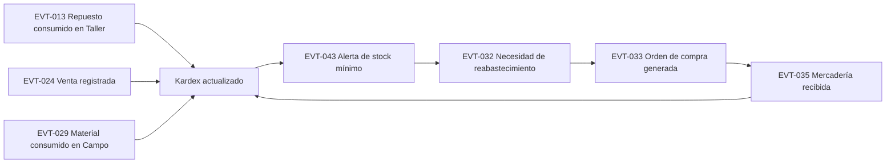

# Business-Events.md — Catálogo de Eventos de Negocio

## 1. Propósito

Identifica los **eventos de negocio** (hechos consumados, siempre en tiempo pasado) que ocurren durante la operación de ISARMIN, siguiendo la técnica de **Event Storming** (Brandolini) ampliamente usada en BABOK y en diseño de dominio (Domain-Driven Design) como puente entre el análisis de negocio y el modelo de dominio.

Un evento de negocio es distinto de un requerimiento funcional: el requerimiento describe una **capacidad del sistema** ("el sistema permitirá..."), mientras que el evento describe **un hecho que ya ocurrió en el negocio** ("el cliente fue registrado", "el equipo fue diagnosticado"). Este catálogo es el insumo directo para:
- Diseñar las transiciones de [Business-States.md](Business-States.md).
- Identificar los puntos donde el sistema debe reaccionar (actualizar inventario, generar notificación, habilitar el siguiente paso del flujo).
- Anticipar el modelo de auditoría (RF-078), ya que cada evento relevante es, por definición, candidato a quedar auditado.

## 2. Convención

**[C]** Confirmado · **[I]** Inferido · **[PV]** Pendiente de Validación. La columna **Origen** referencia el workflow (`WF-XXX`) de [Business-Workflows.md](Business-Workflows.md) que lo genera.

## 3. Eventos de Clientes y Usuarios

| ID | Evento | Origen | Actor que lo origina | Efecto esperado | Estado |
|---|---|---|---|---|---|
| EVT-001 | Cliente registrado | RF-012 | Recepcionista/Vendedor | Cliente disponible para asociar a ventas/OT | [C] |
| EVT-002 | Cliente editado | RF-013 | Recepcionista/Vendedor | Datos actualizados | [I] |
| EVT-003 | Cliente dado de baja (lógica) | RF-014 | Administrador | Cliente no seleccionable en nuevas operaciones, historial conservado | [PV] |
| EVT-004 | Usuario creado | RF-001 | Administrador | Usuario habilitado para autenticarse | [I] |
| EVT-040 | Usuario autenticado | RF-004 | Cualquier actor interno | Sesión iniciada | [I] |
| EVT-041 | Usuario bloqueado por intentos fallidos | RF-006 | Sistema | Acceso denegado temporalmente | [PV] |
| EVT-042 | Acción crítica auditada | RF-078 | Sistema | Registro inmutable en bitácora de auditoría | [C] |

## 4. Eventos de Taller (Orden de Trabajo) — WF-001

| ID | Evento | Actor que lo origina | Efecto esperado | Estado |
|---|---|---|---|---|
| EVT-005 | Equipo recibido | Recepcionista | Creación implícita del registro de equipo | [C] |
| EVT-006 | Orden de Trabajo generada | Recepcionista | OT en estado **Recibido** (RN-004) | [C] |
| EVT-007 | Comprobante de recepción emitido | Recepcionista | Documento entregado al cliente | [C] |
| EVT-008 | Diagnóstico registrado | Técnico | OT pasa a **Diagnosticado** | [I] |
| EVT-009 | Cotización de reparación generada | Técnico/Supervisor | OT pasa a **Cotizado** | [I] |
| EVT-010 | Cotización de reparación aprobada por el cliente | Recepcionista (registra la decisión) | OT pasa a **Aprobado**, habilita reparación | [I] |
| EVT-011 | Cotización de reparación rechazada por el cliente | Recepcionista | OT pasa a **Rechazado/Cerrado** | [PV] |
| EVT-012 | Reparación iniciada | Técnico | OT pasa a **En reparación** | [I] |
| EVT-013 | Repuesto consumido en reparación | Técnico | Descuento de inventario compartido (RN-002, RN-018) | [C] |
| EVT-014 | Pruebas realizadas | Técnico | OT pasa a **Listo para entrega** | [I] |
| EVT-015 | Estado de pago de reparación registrado (completo, adelanto, o saldo pendiente autorizado) | Administrador, Ventas o Técnico | Se registra junto con la entrega, no antes (RN-001, corregida 2026-07-18) | [C] |
| EVT-016 | Equipo entregado | Administrador, Ventas o Técnico | OT pasa a **Entregado/Cerrado** | [C] |
| EVT-046 | Saldo pendiente de una OT cobrado | Administrador, Ventas | No cambia el estado de la OT (ya cerrada); cierra la cuenta por cobrar | [I] |
| EVT-017 | Garantía registrada sobre una reparación | Técnico/Supervisor | Cobertura activa por período definido | [PV] |
| EVT-044 | Garantía vencida | Sistema (por fecha) | Cobertura ya no aplicable | [PV] |
| EVT-045 | Equipo reingresado bajo garantía | Recepcionista | Nueva OT vinculada a garantía previa | [PV] |

## 5. Eventos de Ventas — WF-002

| ID | Evento | Actor que lo origina | Efecto esperado | Estado |
|---|---|---|---|---|
| EVT-018 | Cotización de venta emitida | Vendedor | Documento sin efecto en inventario | [I] |
| EVT-019 | Cotización de venta convertida en venta | Vendedor | Genera venta formal | [PV] |
| EVT-020 | Cotización de venta vencida | Sistema (por fecha) | Cotización ya no convertible | [PV] |
| EVT-021 | Venta registrada | Vendedor | Pendiente de validación de stock | [I] |
| EVT-022 | Comprobante de venta emitido (boleta/factura/nota/ticket) | Sistema | Documento tributario o interno generado | [C] |
| EVT-023 | Cobro de venta registrado | Vendedor/Cajero | Venta pasa a **Pagada** | [PV] |
| EVT-024 | Inventario actualizado por venta | Sistema | Kardex refleja la salida (RN-002) | [C] |
| EVT-025 | Venta anulada | Rol autorizado | Reversión de inventario, marca de auditoría | [PV] |

## 6. Eventos de Servicios de Campo — WF-003

| ID | Evento | Actor que lo origina | Efecto esperado | Estado |
|---|---|---|---|---|
| EVT-026 | Solicitud de servicio de campo registrada | Recepcionista | Solicitud en estado **Solicitado** | [I] |
| EVT-027 | Técnico asignado y visita agendada | Supervisor | Solicitud pasa a **Agendado** | [PV] |
| EVT-028 | Trabajo de campo ejecutado | Técnico de campo | Solicitud pasa a **En ejecución** | [I] |
| EVT-029 | Material/repuesto consumido en campo | Técnico de campo | Descuento de inventario compartido | [C] |
| EVT-030 | Conformidad del cliente registrada | Técnico de campo | Solicitud pasa a **Conforme** | [PV] |
| EVT-031 | Cobro de servicio de campo registrado | Técnico/Cajero | Solicitud pasa a **Cerrado** | [PV] |

## 7. Eventos de Compras — WF-004

| ID | Evento | Actor que lo origina | Efecto esperado | Estado |
|---|---|---|---|---|
| EVT-032 | Necesidad de reabastecimiento detectada | Almacenero / Sistema | Sugerencia de compra | [PV] |
| EVT-033 | Orden de compra generada | Almacenero | OC en estado **Generada** | [PV] |
| EVT-034 | Orden de compra aprobada | Gerente (hipótesis) | OC pasa a **Aprobada** | [PV] |
| EVT-035 | Mercadería recibida | Almacenero | OC pasa a **Recibida** (parcial o total) | [I] |
| EVT-036 | Inventario y costo actualizados por compra | Sistema | Kardex y costo de referencia actualizados | [I] |

## 8. Eventos de Caja

| ID | Evento | Actor que lo origina | Efecto esperado | Estado |
|---|---|---|---|---|
| EVT-037 | Caja aperturada | Cajero/Vendedor | Habilita registro de cobros del turno | [PV] |
| EVT-038 | Caja cerrada | Cajero/Vendedor | Genera reporte de turno | [PV] |
| EVT-039 | Diferencia de caja detectada | Sistema (al conciliar) | Genera observación para revisión | [PV] |

## 9. Eventos de Inventario

| ID | Evento | Actor que lo origina | Efecto esperado | Estado |
|---|---|---|---|---|
| EVT-043 | Alerta de stock mínimo generada | Sistema | Notificación a Almacenero | [PV] |

## 10. Mapa de reacción entre eventos (cadenas relevantes)

Algunos eventos disparan reacciones en otros módulos — esta cadena es la evidencia más concreta de por qué el inventario compartido (RN-006) es el punto de integración crítico del dominio:

## 11. Nota

Todos los eventos marcados **[PV]** dependen de una decisión de negocio aún no confirmada (por ejemplo, si existe o no el concepto de "caja" formal, o si las cotizaciones de venta tienen vigencia). Ver [Business-Questions.md](Business-Questions.md) para las preguntas asociadas antes de asumir que estos eventos existen tal como se describen.
