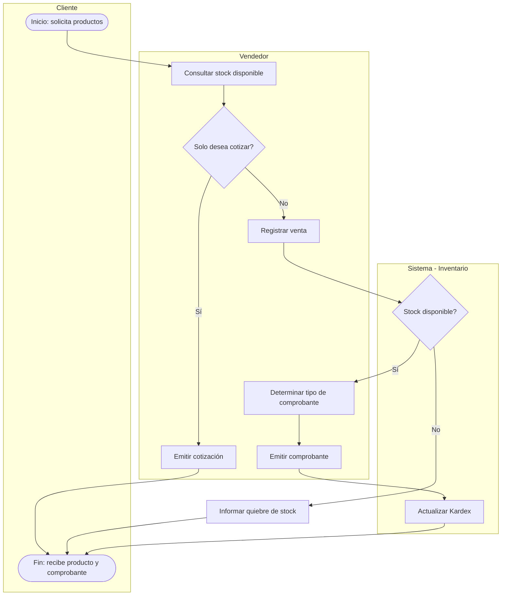
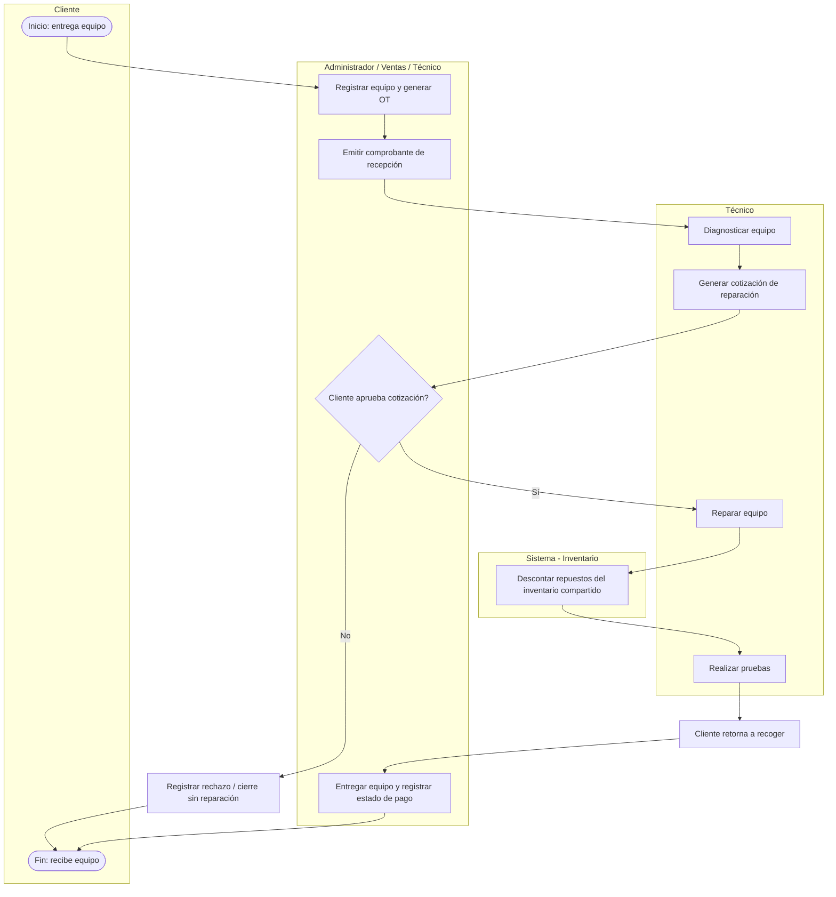
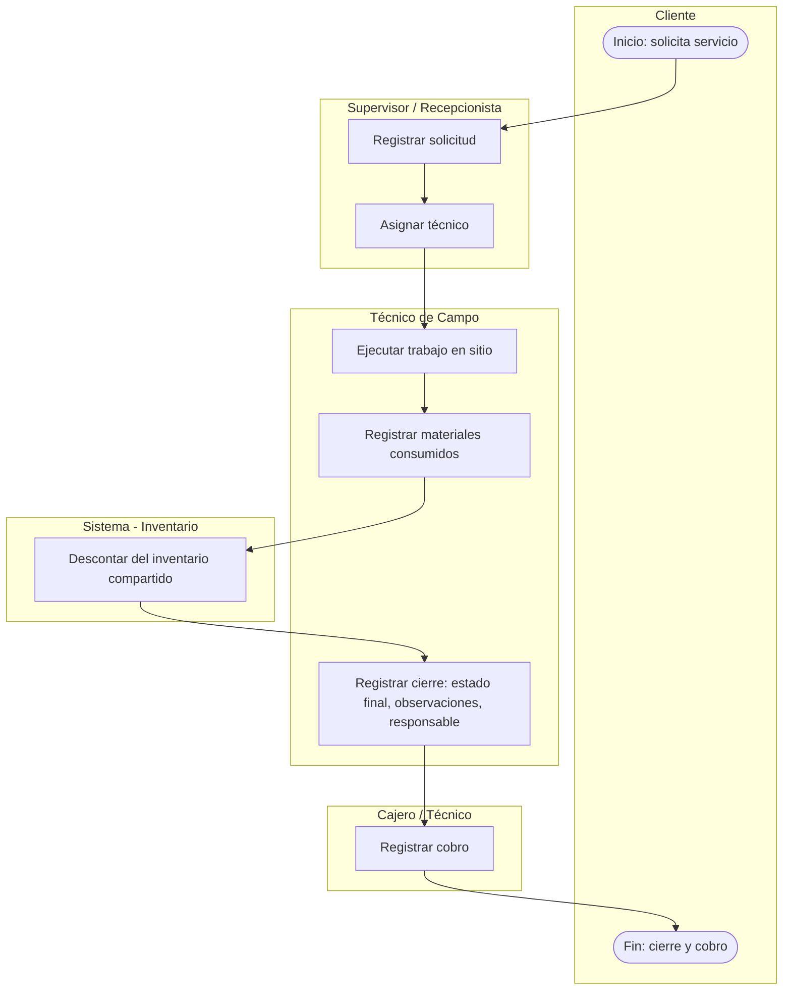
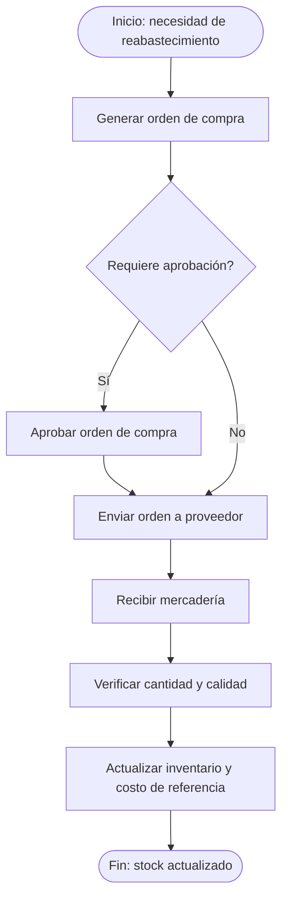
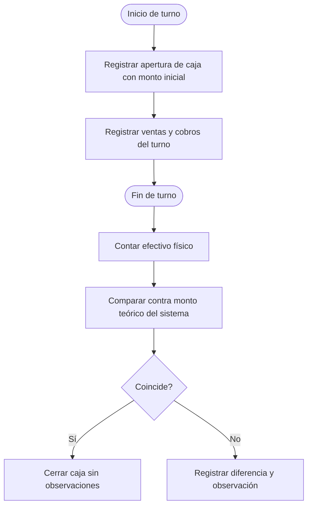

# Business-Processes.md — Procesos de Negocio

## 1. Propósito

Describe los procesos de negocio de ISARMIN PERÚ S.A.C. a nivel end-to-end, de forma independiente de cualquier sistema, siguiendo la notación conceptual de **BPMN 2.0** (pools = organización, lanes = actor/rol, tareas, eventos de inicio/fin, compuertas de decisión).

Un **proceso de negocio** responde a la pregunta *"¿qué secuencia de actividades entrega valor al negocio, de principio a fin?"*. Es el nivel macro; el detalle operativo de cada paso (con condiciones, validaciones y transiciones de estado) se documenta en [Business-Workflows.md](Business-Workflows.md).

## 2. Convención

**[C]** Confirmado por la documentación fuente · **[I]** Inferido del contexto de negocio · **[PV]** Pendiente de Validación.

Los diagramas se expresan en sintaxis Mermaid (`flowchart`), agrupando actividades por actor mediante subgrafos, como aproximación textual a un diagrama BPMN de carriles (*swimlanes*).

---

## BP-001 — Venta en Tienda Comercial

- **Estado:** [I] (el documento fuente declara los documentos de venta emitidos, pero no describe el flujo paso a paso)
- **Disparador:** Un cliente solicita comprar uno o más productos en el local.
- **Actores:** Cliente (externo), Vendedor, Almacenero (implícito, custodia de stock), Cajero/Vendedor (cobro).
- **Salida:** Comprobante de venta (cotización, boleta, factura, nota de venta o ticket) y actualización del inventario.
- **Reglas de negocio aplicables:** RN-003, RN-006, RN-009, RN-010, RN-011.
- **Preguntas abiertas:** BQ-010 a BQ-019.

### Descripción narrativa

1. El cliente solicita uno o más productos.
2. El vendedor consulta la disponibilidad en el inventario compartido.
3. Si el cliente solo desea conocer el precio, el vendedor emite una **cotización** (sin afectar stock).
4. Si el cliente decide comprar, el vendedor registra la venta y el sistema valida stock disponible (RN-003).
5. Se determina el tipo de comprobante a emitir según el tipo de cliente (natural/jurídico) — **[PV] BQ-011**.
6. Se registra el cobro (medio de pago) — flujo detallado en BP-005 (Caja).
7. Se actualiza automáticamente el inventario (Kardex) — RN-002, RN-006.
8. Se entrega el producto y el comprobante al cliente.

---

## BP-002 — Atención en Taller de Servicio Técnico

- **Estado:** [C] (proceso descrito explícitamente en la documentación fuente)
- **Disparador:** Un cliente entrega un equipo para reparación.
- **Actores:** Cliente, y Administrador/Ventas/Técnico de forma configurable para la recepción y entrega (confirmado 2026-07-18, ver Actors.md).
- **Salida:** Equipo reparado y entregado, estado de pago registrado (completo, adelanto, o saldo pendiente), historial del equipo actualizado.
- **Reglas de negocio aplicables:** RN-001, RN-002, RN-003, RN-004, RN-005, RN-016, RN-017, RN-018.
- **Preguntas abiertas:** BQ-032 a BQ-036.

### Descripción narrativa (confirmada por la documentación fuente)

1. El cliente entrega el equipo.
2. Se llena un formato de recepción (a digitalizar íntegramente, según objetivo del proyecto).
3. Se entrega un comprobante de recepción al cliente.
4. El técnico realiza el diagnóstico.
5. Se genera una cotización de reparación.
6. El cliente aprueba (o rechaza — **[PV] BQ-034**, no documentado qué ocurre en caso de rechazo).
7. Se realiza la reparación, consumiendo repuestos del almacén compartido.
8. Se realizan pruebas.
9. El cliente retorna a recoger el equipo listo.
10. En ese momento se entrega el equipo y se registra el estado del pago (completo, adelanto, o saldo pendiente autorizado — **RN-001, corregida el 2026-07-18, resuelve BQ-033**; el pago ya no bloquea la entrega).

---

## BP-003 — Servicio Técnico de Campo

- **Estado:** [C] — confirmado por el propietario (2026-07-18): "Cliente solicita servicio → se evalúa el trabajo → se realiza una cotización → se determinan materiales necesarios → los materiales salen del inventario de la tienda → se realiza el trabajo → se entrega comprobante/cotización final." El cierre se registra con estado final, observaciones y usuario responsable (BQ-039 resuelta) — sin firma digital ni evidencias avanzadas en V1.
- **Disparador:** Un cliente solicita un trabajo técnico fuera del local (instalación, mantenimiento, cambio de equipo).
- **Actores:** Cliente, Recepcionista/Supervisor (agenda), Técnico de campo.
- **Salida:** Trabajo ejecutado, materiales consumidos registrados, cobro realizado.
- **Reglas de negocio aplicables:** RN-006, RN-019, RN-020.
- **Preguntas abiertas:** BQ-037 a BQ-040.

### Descripción narrativa (inferida por analogía con BP-002, pendiente de confirmar con el cliente)

1. El cliente solicita un servicio.
2. Se registra la solicitud y se agenda/asigna un técnico — **[PV] BQ-037**.
3. El técnico se traslada y ejecuta el trabajo en el domicilio/local del cliente.
4. El técnico registra materiales/repuestos consumidos, descontados del inventario compartido.
5. Se registra el cierre: estado final del servicio, observaciones y usuario responsable — **[C] BQ-039 resuelta**.
6. Se cobra el servicio (completo, adelanto, o saldo pendiente autorizado por el Administrador) — **[C] RN-031**, con los medios de pago configurables de CAT-008.

---

## BP-004 — Compras a Proveedores

- **Estado:** [C] — simplificado tras confirmación del propietario (2026-07-18): las compras se hacen directamente a proveedores u otras tiendas, sin flujo formal de orden de compra ni aprobación previa (RN-024). El diagrama de aprobación (compuerta D2) no aplica en el MVP; se conserva como referencia para un eventual proceso más formal si el negocio crece.
- **Disparador:** Necesidad de reabastecer inventario (manual o por alerta de stock mínimo).
- **Actores:** Almacenero, Proveedor (externo), Gerente (aprobación, **[PV]**).
- **Salida:** Mercadería recibida e inventario actualizado.
- **Reglas de negocio aplicables:** RN-006, RN-012, RN-013.
- **Preguntas abiertas:** BQ-020 a BQ-023.

---

## BP-005 — Gestión de Caja (Apertura y Cierre)

- **Estado:** [C] — el propietario confirmó que el ERP debe implementar registro de ingresos/egresos, control diario y cierre de caja con reportes (RN-014, RN-025). El mecanismo exacto de arqueo (BQ-031) y el monto de apertura siguen sin definir en detalle.
- **Disparador:** Inicio o fin de un turno de atención.
- **Actores:** Cajero/Vendedor, Contador (conciliación).
- **Salida:** Caja conciliada y reporte de movimientos.
- **Preguntas abiertas:** BQ-030, BQ-031.

## 3. Procesos no descritos por falta de información

No se documenta un proceso end-to-end para **Garantías** ni para **Devoluciones** por ausencia total de información de negocio (no existe ni siquiera una mención al flujo). Deben levantarse directamente con el cliente (ver BQ-035, BQ-036 y una pregunta nueva a incorporar sobre devoluciones si el cliente confirma que existen).
