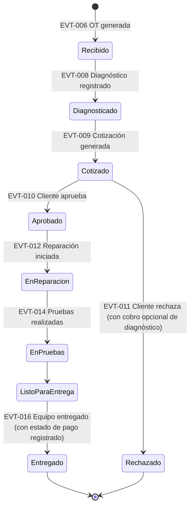
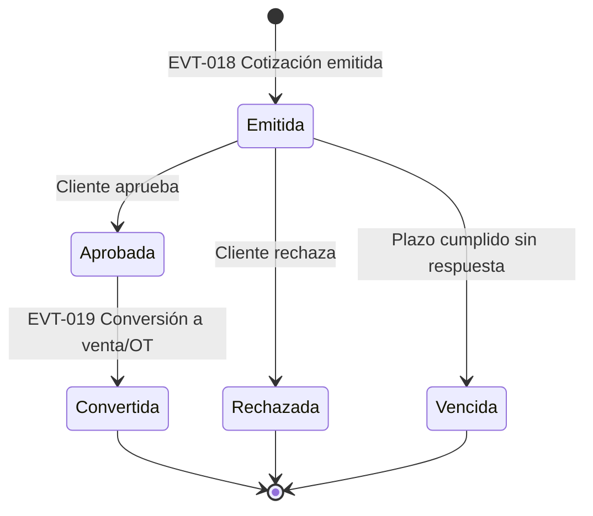
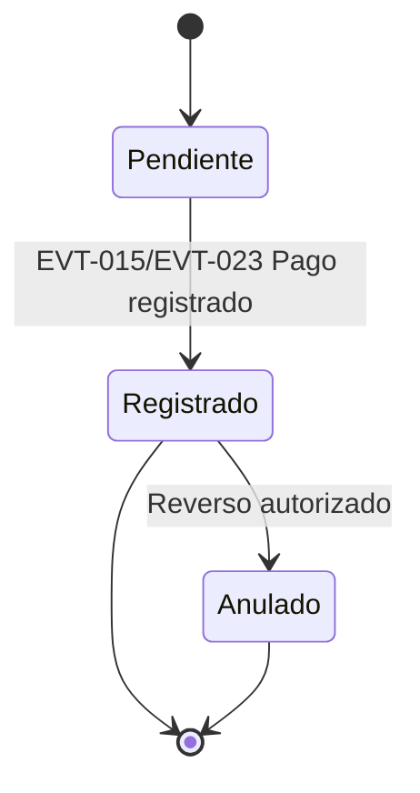
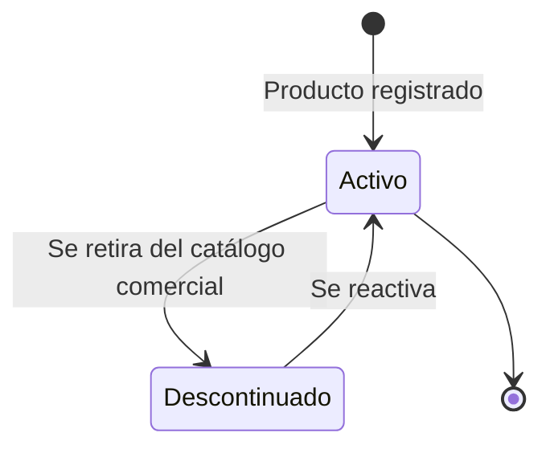
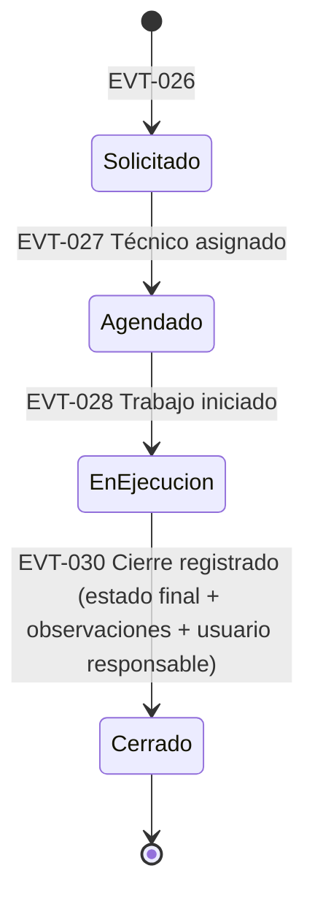
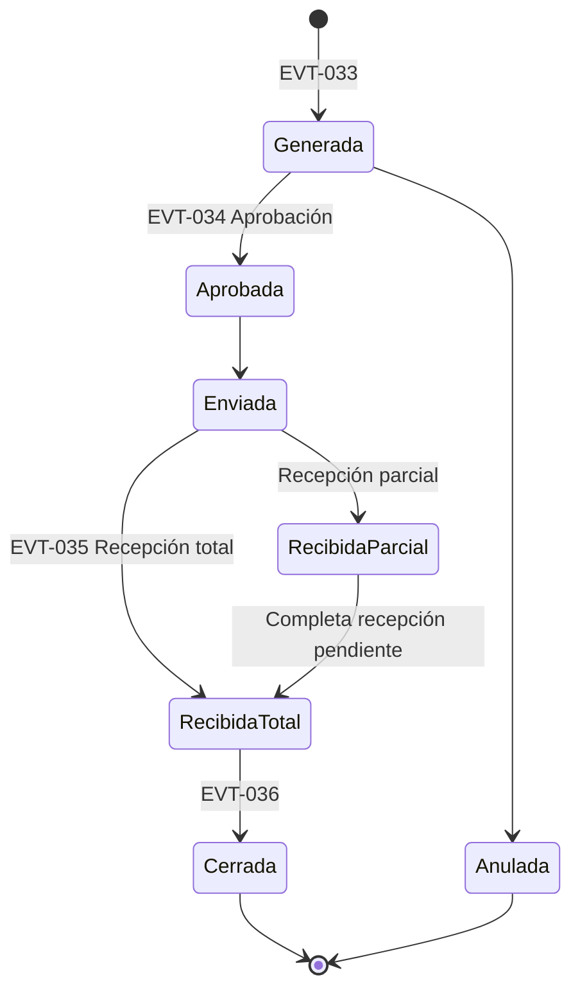
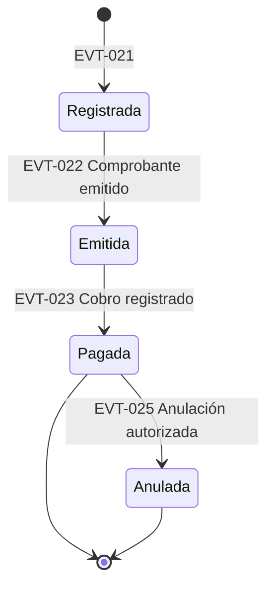

# Business-States.md — Estados de los Procesos de Negocio

## 1. Propósito

Formaliza, mediante **diagramas de estado UML** (State Machine Diagrams), el ciclo de vida de las entidades de negocio más relevantes. Es el documento de mayor impacto directo sobre el futuro modelo de dominio: cada estado aquí definido es candidato a convertirse en un atributo de estado de una entidad, y cada transición debe corresponder a un evento ya listado en [Business-Events.md](Business-Events.md).

## 2. Convención

**[C]** Confirmado · **[I]** Inferido · **[PV]** Pendiente de Validación. Salvo el estado de la OT (parcialmente confirmado por el proceso narrado en `PROJECT_CONTEXT.md`), **todos los diagramas de este documento son propuestas del analista** y deben validarse explícitamente con el cliente antes de fijarse en el modelo de dominio — son, en términos de BABOK, un *"elicitation result"* a confirmar, no un requerimiento aprobado.

---

## ST-001 — Orden de Trabajo (OT)

**Estado del diagrama:** [C] — confirmado por el propietario en dos rondas de validación (2026-07-18); el cierre del flujo (Listo para Entrega → Entregado) fue corregido explícitamente al resolver **BQ-033** (ver `Business-Rules.md`, RN-001).

| Desde | Evento disparador | Hasta | Regla asociada |
|---|---|---|---|
| (inicio) | Equipo recibido y OT generada | Recibido | RN-004 |
| Recibido | Diagnóstico registrado | Diagnosticado | — |
| Diagnosticado | Cotización generada | Cotizado | — |
| Cotizado | Cliente aprueba | Aprobado | RN-016 |
| Cotizado | Cliente rechaza | Rechazado | RN-030 — **resuelta:** se permite cobro opcional del diagnóstico, decisión caso por caso (**BQ-034** resuelta) |
| Aprobado | Reparación iniciada | En Reparación | RN-018 |
| En Reparación | Pruebas realizadas | En Pruebas → Listo para Entrega | — |
| Listo para Entrega | Equipo entregado al cliente | Entregado (final) | RN-001 (corregida) |

**Resuelto (2026-07-18, respuesta a BQ-033):** el estado "Pagado" **se elimina como estado bloqueante independiente** de la máquina de estados de la OT. El pago ya no es un prerrequisito para pasar de "Listo para Entrega" a "Entregado" — en su lugar, la transición a **Entregado** registra simultáneamente un **estado de pago** como atributo del evento de entrega (no como estado previo obligatorio), con estas variantes válidas: pago completo antes de la entrega, pago completo al momento de la entrega, adelanto, o saldo pendiente autorizado.

**Resuelto (2026-07-18, respuesta a BQ-093):** dejar saldo pendiente **requiere autorización del Administrador/Propietario** (no de cualquier usuario). La entrega debe registrar: fecha/hora, usuario que entrega, estado del pago, monto pagado, saldo pendiente y, si aplica, el usuario Administrador que autorizó el saldo pendiente.

---

## ST-002 — Cotización (Ventas o Taller)

**Estado del diagrama:** [PV] — sin confirmación alguna en la documentación fuente.

**Preguntas abiertas:** ¿existe un plazo de vigencia para una cotización? → **BQ-015**. ¿Una cotización vencida puede reactivarse? → **BQ-016**.

---

## ST-003 — Pago (transversal a Ventas y Taller)

**Estado del diagrama:** [PV].

**Preguntas abiertas:** ¿se permiten pagos parciales/anticipos? → **BQ-034** (Taller); **BQ-017** (Ventas). ¿Bajo qué condiciones se anula un pago ya registrado? → **BQ-013**.

---

## ST-004 — Producto (ciclo de vida en el catálogo de Inventario)

**Estado del diagrama:** [PV]. Se distingue explícitamente del **nivel de stock** (que es una cantidad, no un estado) — ver nota al final de esta sección.

**Nota conceptual:** el nivel de stock (0, 5, 100 unidades) **no es un estado del producto**, sino un valor calculado a partir del Kardex (RN-002). No obstante, a nivel de interfaz suele derivarse un indicador informativo ("Disponible" / "Stock Bajo" / "Agotado") a partir de ese valor — este indicador es una vista, no una máquina de estados independiente, y su umbral depende de RF-031 (**BQ-005**).

---

## ST-005 — Servicio de Campo

**Estado del diagrama:** [C] — confirmado por el propietario (2026-07-18, tres rondas de validación).

**Resuelto (2026-07-18, respuesta a BQ-039):** el cierre del servicio se registra con tres campos: **estado final del servicio, observaciones, y usuario responsable del cierre**. Se descartan explícitamente para V1: firma digital, evidencias fotográficas avanzadas y confirmación desde dispositivos móviles (consistente con RF-071: V1 es 100% web). Esto simplifica el diagrama: ya no existen los estados intermedios "Conforme"/"Observado" propuestos originalmente por el analista — el estado final (ej. "Conforme", "Con observaciones") pasa a ser un **valor del campo "estado final"**, no un estado separado de la máquina de estados.

**Actualización de contexto:** el propietario confirmó el proceso general (solicitud → evaluación → cotización → materiales del inventario → ejecución → cierre), validando que es análogo al de Taller, y que para el MVP el registro ocurre al volver a la red local (no en tiempo real desde el sitio del cliente) — ver `Business-Questions.md` BQ-052/BQ-053.

---

## ST-006 — Orden de Compra

**Estado del diagrama:** [PV] — íntegramente propuesto.

**Preguntas abiertas:** ¿se requiere aprobación formal de las compras? ¿bajo qué monto? → **BQ-020**. ¿se acepta recepción parcial? → **BQ-023**.

**Actualización 2026-07-18:** el propietario confirmó que las compras se realizan **directamente** a proveedores, sin flujo de aprobación previa (RN-024, `Business-Catalogs.md` CAT-011). Este diagrama se simplifica en la práctica a *Registrada → Recibida*; se conserva la versión completa por si el proceso se formaliza en el futuro.

---

## ST-007 — Venta / Comprobante de Venta

**Estado del diagrama:** [PV].

**Preguntas abiertas:** ¿puede anularse una venta ya pagada, o solo antes del cobro? → **BQ-013**. ¿Una venta anulada revierte el comprobante ante SUNAT (nota de crédito) o simplemente se marca internamente? → **BQ-018**.

## 3. Advertencia general

Ningún diagrama de este documento —salvo ST-001, parcialmente— debe tomarse como definitivo para el diseño de la base de datos. Son hipótesis de trabajo destinadas a **acelerar la conversación con el cliente** (mostrar un diagrama es más eficiente que preguntar en abstracto "¿qué estados tiene una venta?"), no una regla de negocio aprobada.
