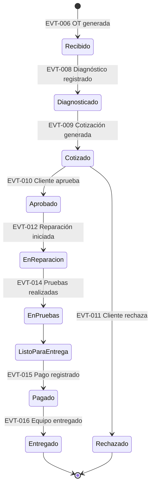
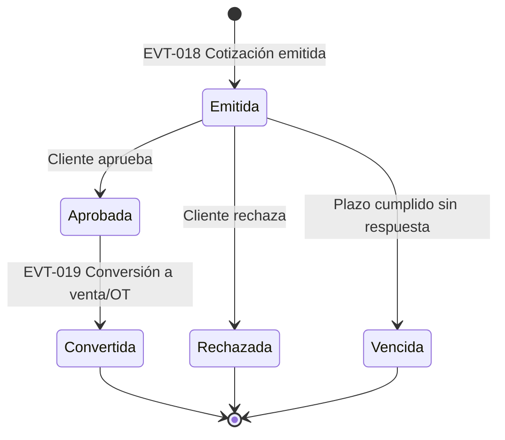
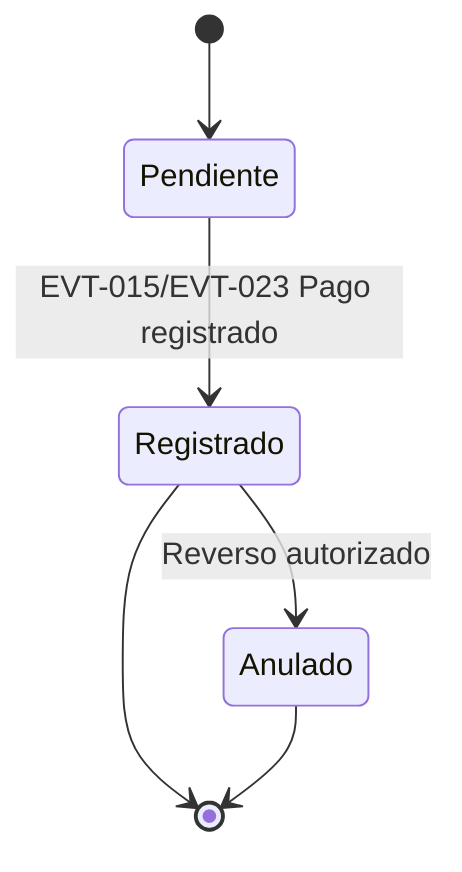
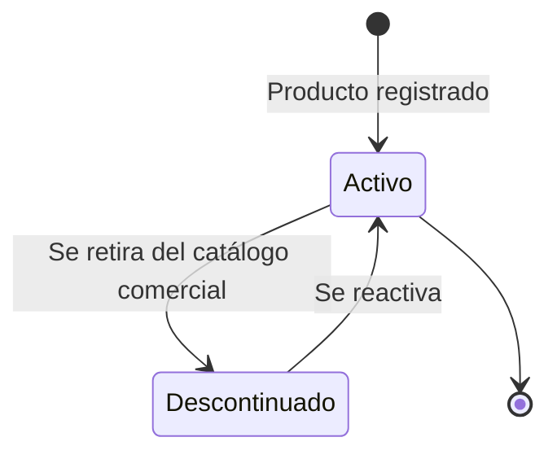
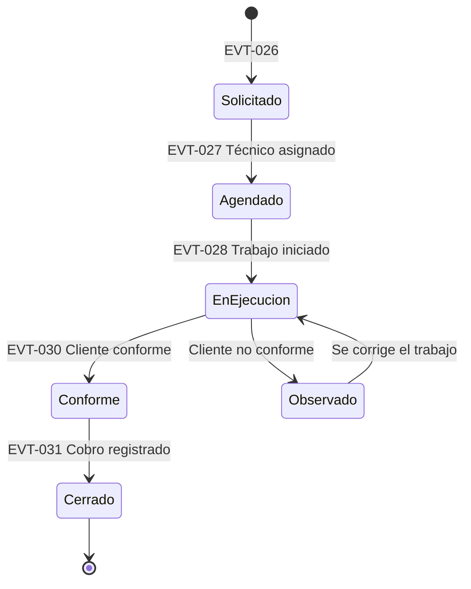
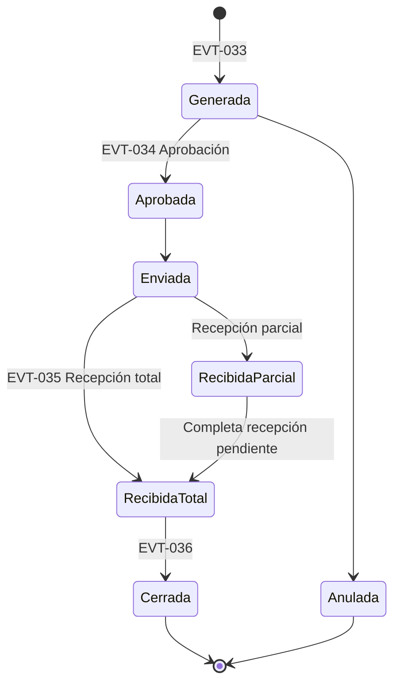
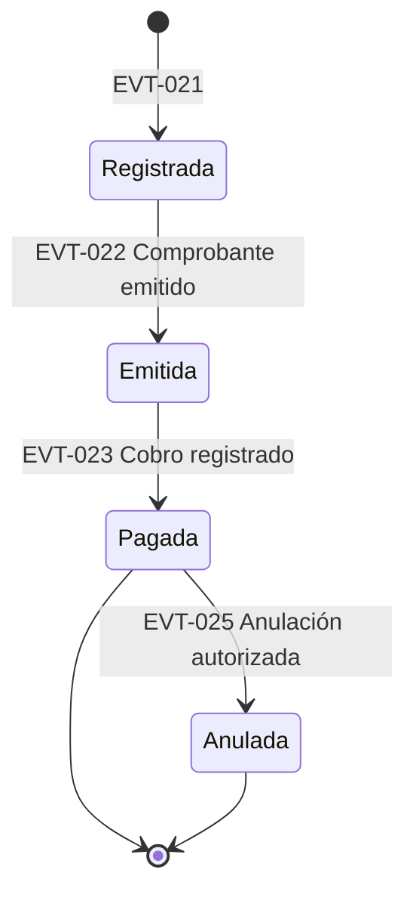

# Business-States.md — Estados de los Procesos de Negocio

## 1. Propósito

Formaliza, mediante **diagramas de estado UML** (State Machine Diagrams), el ciclo de vida de las entidades de negocio más relevantes. Es el documento de mayor impacto directo sobre el futuro modelo de dominio: cada estado aquí definido es candidato a convertirse en un atributo de estado de una entidad, y cada transición debe corresponder a un evento ya listado en [Business-Events.md](Business-Events.md).

## 2. Convención

**[C]** Confirmado · **[I]** Inferido · **[PV]** Pendiente de Validación. Salvo el estado de la OT (parcialmente confirmado por el proceso narrado en `PROJECT_CONTEXT.md`), **todos los diagramas de este documento son propuestas del analista** y deben validarse explícitamente con el cliente antes de fijarse en el modelo de dominio — son, en términos de BABOK, un *"elicitation result"* a confirmar, no un requerimiento aprobado.

---

## ST-001 — Orden de Trabajo (OT)

**Estado del diagrama:** [I] — secuencia de estados inferida directamente del proceso narrado en la documentación fuente; los nombres exactos de los estados son propuesta del analista.

| Desde | Evento disparador | Hasta | Regla asociada |
|---|---|---|---|
| (inicio) | Equipo recibido y OT generada | Recibido | RN-004 |
| Recibido | Diagnóstico registrado | Diagnosticado | — |
| Diagnosticado | Cotización generada | Cotizado | — |
| Cotizado | Cliente aprueba | Aprobado | RN-016 |
| Cotizado | Cliente rechaza | Rechazado | **BQ-034** (¿qué ocurre con el diagnóstico ya realizado? ¿se cobra?) |
| Aprobado | Reparación iniciada | En Reparación | RN-018 |
| En Reparación | Pruebas realizadas | En Pruebas → Listo para Entrega | — |
| Listo para Entrega | Pago registrado | Pagado | RN-001 |
| Pagado | Equipo entregado | Entregado (final) | RN-001 |

**Punto crítico sin confirmar:** el orden estricto entre "Pagado" y "Entregado" — RN-001 solo establece que no puede entregarse sin pago, no si ambos pueden ocurrir en el mismo acto. **BQ-033**.

**Actualización 2026-07-18:** el propietario confirmó el flujo general (Recibido → Diagnosticado → Cotizado → Aprobado/Rechazado → En Reparación → En Pruebas → Pagado → Entregado), validando la secuencia de estados propuesta. Sin embargo, describió el cierre como *"Cliente recoge equipo → Se realiza cobro"*, narrando el recojo antes del cobro — una posible tensión con RN-001 que **no se resuelve por asunción** (ver la nota correspondiente en `Business-Rules.md`, sección 3). Hasta que se aclare puntualmente, este diagrama se mantiene sin cambios en el orden Pagado → Entregado, por ser la lectura más consistente con RN-001.

---

## ST-002 — Cotización (Ventas o Taller)

**Estado del diagrama:** [PV] — sin confirmación alguna en la documentación fuente.

**Preguntas abiertas:** ¿existe un plazo de vigencia para una cotización? → **BQ-015**. ¿Una cotización vencida puede reactivarse? → **BQ-016**.

---

## ST-003 — Pago (transversal a Ventas y Taller)

**Estado del diagrama:** [PV].

**Preguntas abiertas:** ¿se permiten pagos parciales/anticipos? → **BQ-034** (Taller); **BQ-017** (Ventas). ¿Bajo qué condiciones se anula un pago ya registrado? → **BQ-013**.

---

## ST-004 — Producto (ciclo de vida en el catálogo de Inventario)

**Estado del diagrama:** [PV]. Se distingue explícitamente del **nivel de stock** (que es una cantidad, no un estado) — ver nota al final de esta sección.

**Nota conceptual:** el nivel de stock (0, 5, 100 unidades) **no es un estado del producto**, sino un valor calculado a partir del Kardex (RN-002). No obstante, a nivel de interfaz suele derivarse un indicador informativo ("Disponible" / "Stock Bajo" / "Agotado") a partir de ese valor — este indicador es una vista, no una máquina de estados independiente, y su umbral depende de RF-031 (**BQ-005**).

---

## ST-005 — Servicio de Campo

**Estado del diagrama:** [PV] — íntegramente propuesto por analogía con la OT.

**Preguntas abiertas:** ¿existe la posibilidad de que el cliente no dé conformidad? ¿Cómo se resuelve? → **BQ-039**.

**Actualización 2026-07-18:** el propietario confirmó el proceso general (solicitud → evaluación → cotización → materiales del inventario → ejecución → entrega de comprobante), validando que es análogo al de Taller. No se confirmó un paso explícito de "conformidad" formal (firma, foto) — BQ-039 sigue abierta. También se confirmó que, para el MVP, el registro de este proceso ocurre al volver a la red local (no en tiempo real desde el sitio del cliente) — ver `Business-Questions.md` BQ-052/BQ-053.

---

## ST-006 — Orden de Compra

**Estado del diagrama:** [PV] — íntegramente propuesto.

**Preguntas abiertas:** ¿se requiere aprobación formal de las compras? ¿bajo qué monto? → **BQ-020**. ¿se acepta recepción parcial? → **BQ-023**.

**Actualización 2026-07-18:** el propietario confirmó que las compras se realizan **directamente** a proveedores, sin flujo de aprobación previa (RN-024, `Business-Catalogs.md` CAT-011). Este diagrama se simplifica en la práctica a *Registrada → Recibida*; se conserva la versión completa por si el proceso se formaliza en el futuro.

---

## ST-007 — Venta / Comprobante de Venta

**Estado del diagrama:** [PV].

**Preguntas abiertas:** ¿puede anularse una venta ya pagada, o solo antes del cobro? → **BQ-013**. ¿Una venta anulada revierte el comprobante ante SUNAT (nota de crédito) o simplemente se marca internamente? → **BQ-018**.

## 3. Advertencia general

Ningún diagrama de este documento —salvo ST-001, parcialmente— debe tomarse como definitivo para el diseño de la base de datos. Son hipótesis de trabajo destinadas a **acelerar la conversación con el cliente** (mostrar un diagrama es más eficiente que preguntar en abstracto "¿qué estados tiene una venta?"), no una regla de negocio aprobada.
