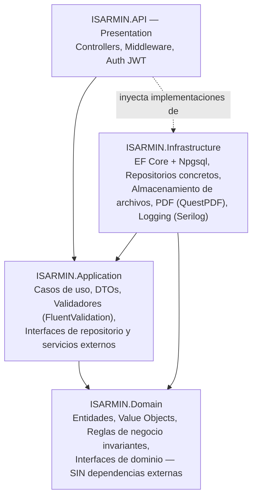
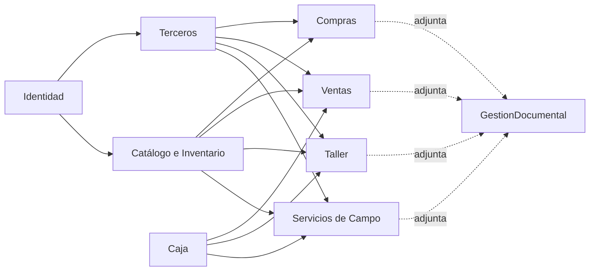

# Architecture-Overview.md — Arquitectura del Sistema (Fase 3: Diseño)

## 1. Propósito

Define la arquitectura de ISARMIN ERP: capas, estructura de solución, límites de módulos (bounded contexts) y patrones transversales. Es la traducción directa de [Conceptual-Data-Model.md](../01-Requirements/Conceptual-Data-Model.md) y [Use-Cases.md](../01-Requirements/Use-Cases.md) a una estructura de software concreta, respetando las decisiones ya tomadas en [TECH_STACK.md](../00-Project/TECH_STACK.md) y [DECISIONS.md](../00-Project/DECISIONS.md) (ADR-001 a ADR-005).

Ninguna decisión de este documento contradice una regla de negocio. Donde una decisión de arquitectura requeriría interpretar una regla no documentada, se marca explícitamente **[PENDIENTE]** en vez de asumirse.

## 2. Principios rectores

1. **Regla de dependencia de Clean Architecture:** las capas internas (Domain) no conocen a las externas (Infrastructure, API). Toda dependencia apunta hacia adentro.
2. **SOLID y Clean Code**, conforme a `CODING_STANDARDS.md`.
3. **Roles y catálogos configurables, no fijos en código** (RN-028): la arquitectura no debe usar enums de rol hardcodeados para autorización (ver sección 8).
4. **Extensibilidad sin romper la arquitectura principal**: los puntos de extensión previstos (app móvil/offline para Campo, lectura de código de barras, multi-sucursal, nube como almacenamiento secundario) se habilitan mediante abstracciones (interfaces), no se construyen ahora.
5. **Nada de lo excluido explícitamente de V1 se incluye en esta arquitectura** (sección 12).

## 3. Vista de capas



| Capa | Responsabilidad | No debe contener |
|---|---|---|
| **Domain** | Entidades (ver `Conceptual-Data-Model.md`), invariantes de negocio que no dependen de infraestructura (ej. "una OT debe tener un cliente" — RN-004). | Referencias a EF Core, ASP.NET, PostgreSQL. |
| **Application** | Casos de uso (uno por cada `UC-XX` de `Use-Cases.md`), orquestación, DTOs, validación de entrada, interfaces (`IProductoRepository`, `IAlmacenamientoArchivos`, etc.). | Implementación concreta de acceso a datos. |
| **Infrastructure** | Implementación de las interfaces de Application/Domain: EF Core `DbContext`, repositorios, servicio de archivos, generación de PDF, envío a impresora. | Lógica de negocio. |
| **API** | Controladores REST, autenticación JWT, autorización, mapeo HTTP ↔ Application (DTOs), Swagger. | Lógica de negocio y acceso a datos directo. |

## 4. Estructura de la solución .NET

```
ISARMIN.sln
├── src/
│   ├── ISARMIN.Domain/
│   │   ├── Entities/            (una carpeta por módulo, ver sección 5)
│   │   ├── Enums/                (catálogos confirmados: TipoMovimientoInventario, MedioPago, etc.)
│   │   └── Common/                (clase base Entity, interfaces de dominio compartidas)
│   ├── ISARMIN.Application/
│   │   ├── Modulos/
│   │   │   ├── Usuarios/
│   │   │   ├── Clientes/
│   │   │   ├── Inventario/
│   │   │   ├── Compras/
│   │   │   ├── Ventas/
│   │   │   ├── Caja/
│   │   │   ├── Taller/
│   │   │   ├── ServiciosCampo/
│   │   │   ├── GestionDocumental/
│   │   │   ├── Reportes/
│   │   │   └── Configuracion/
│   │   └── Common/                (comportamiento transversal: Auditoría, SaldoPendiente)
│   ├── ISARMIN.Infrastructure/
│   │   ├── Persistence/           (DbContext, configuraciones EF Core, migraciones)
│   │   ├── Repositories/
│   │   ├── Storage/                (IAlmacenamientoArchivos → implementación local)
│   │   ├── Reporting/               (QuestPDF)
│   │   └── Auditing/                 (interceptor de auditoría)
│   └── ISARMIN.API/
│       ├── Controllers/            (uno por módulo)
│       ├── Middleware/
│       └── Program.cs
└── tests/                             (fuera de alcance de este documento — Fase 4/07-Development)
```

Esta estructura sigue el patrón de **"Application organizada por módulo/feature"** en lugar de por tipo técnico (no hay una carpeta `Services/` genérica con 40 archivos) — es más mantenible a largo plazo y refleja directamente los límites de dominio de la sección 5.

## 5. Límites de módulos (Bounded Contexts)

Cada módulo de negocio (`PROJECT_SCOPE.md`) se traduce en una carpeta/namespace propio dentro de `Domain` y `Application`. Un módulo **no** referencia directamente el `DbContext` de otro — solo sus interfaces expuestas.

| Módulo | Entidades que posee | Depende de |
|---|---|---|
| **Identidad y Acceso** | Usuario, Rol, Permiso, UsuarioRol | — (módulo base) |
| **Terceros** | Cliente, Proveedor | Identidad (auditoría) |
| **Catálogo e Inventario** *(shared kernel)* | Producto, Categoria, MovimientoInventario | Identidad |
| **Compras** | Compra, CompraDetalle | Terceros, Catálogo e Inventario |
| **Ventas** | Venta, VentaDetalle, PagoVenta | Terceros, Catálogo e Inventario, Caja (SaldoPendiente) |
| **Taller** | OrdenTrabajo, Diagnostico, CotizacionReparacion, ConsumoRepuesto, Garantia | Terceros, Catálogo e Inventario, Caja (SaldoPendiente) |
| **Servicios de Campo** | ServicioCampo, ServicioCampoDetalle | Terceros, Catálogo e Inventario, Caja (SaldoPendiente) |
| **Caja** *(incluye Cobranzas)* | Caja, MovimientoCaja, SaldoPendiente | Identidad |
| **Gestión Documental** *(shared kernel)* | DocumentoAdjunto | — (referenciado por Compras, Ventas, Taller, Campo) |
| **Reportes** | (sin entidades propias; consulta de otros módulos) | Todos (solo lectura) |
| **Auditoría** *(transversal, no es un módulo con lógica de negocio)* | Auditoria | Se implementa como interceptor en Infrastructure, no como módulo de Application (ver sección 9) |
| **Configuración** | (parámetros generales, series de comprobantes) | — |
| **ParticipacionTemporal** | Vive dentro de Taller y Servicios de Campo (no es módulo propio) | Taller, Servicios de Campo |

**Nota sobre "Catálogo e Inventario" como shared kernel:** dado que RN-006 exige un inventario único compartido entre Tienda, Taller y Campo, este módulo es intencionalmente compartido — Ventas, Taller y Servicios de Campo dependen de él para consumir stock, pero **nunca se duplica** la lógica de descuento de inventario en cada uno (violaría "no generes código duplicado" de `AI_INSTRUCTIONS.md`). El descuento de stock se expone como un servicio único de Application (`IServicioInventario.RegistrarMovimiento(...)`), invocado desde Ventas/Taller/Campo.

## 6. Diagrama de dependencias entre módulos



## 7. Patrón de datos transversales — resolución concreta

Siguiendo la directriz confirmada de evitar herencia/polimorfismo complejo y priorizar una solución simple compatible con PostgreSQL/EF Core:

### 7.1 SaldoPendiente
Tabla única con **tres claves foráneas opcionales**: `VentaId`, `OrdenTrabajoId`, `ServicioCampoId`. Se garantiza que **exactamente una** esté presente mediante:
- Una restricción `CHECK` a nivel de PostgreSQL (vía migración de EF Core con SQL crudo o `HasCheckConstraint`, disponible desde EF Core 7).
- Validación adicional en Application (FluentValidation) antes de persistir, como capa de defensa adicional (no reemplaza el CHECK de base de datos).

Esto evita `TPH`/`TPT` (herencia de tablas) y evita una tabla polimórfica genérica (`EntidadTipo` + `EntidadId` sin integridad referencial real) — mantiene las claves foráneas reales de PostgreSQL, más simple de mantener y consultar.

### 7.2 MovimientoInventario, MovimientoCaja, DocumentoAdjunto
**Misma solución, por consistencia** (resuelve la pregunta abierta en `Conceptual-Data-Model.md`): claves foráneas opcionales hacia cada posible origen (`VentaId`, `CompraId`, `OrdenTrabajoId`, `ServicioCampoId`, o ninguna para un ajuste manual/gasto operativo directo), en lugar de una referencia polimórfica genérica. Es el mismo patrón, aplicado uniformemente — cumple "no generes código duplicado" al reutilizar el mismo enfoque en vez de inventar uno distinto por entidad.

### 7.3 Auditoria
Caso distinto: por su volumen y por registrar **cualquier** entidad del sistema (no solo 3-4 posibles orígenes), se usa una referencia genérica (`EntidadTipo` como texto/enum + `EntidadId`), **sin integridad referencial declarativa** — es un log, no una relación de negocio, y este es el patrón estándar para bitácoras de auditoría (no se aplica el mismo criterio que a SaldoPendiente porque su propósito es distinto: trazabilidad histórica, no una relación de dominio activa).

## 8. Autenticación y Autorización

- **Autenticación:** JWT (ADR-004), emitido tras validar credenciales contra `Usuario` (hash seguro, RNF-011).
- **Autorización — decisión clave derivada de RN-028:** dado que los roles son configurables (no fijos en código), **no se usará** `[Authorize(Roles = "Administrador")]` de ASP.NET Core de forma literal (eso asumiría roles fijos). En su lugar:
  - Cada endpoint se protege con un **permiso lógico** (ej. `"Inventario.Ajustar"`, `"Taller.Entregar"`), no con un nombre de rol.
  - Al autenticarse, el token JWT incluye los permisos efectivos del usuario (resueltos desde `Rol` → `Permiso` en ese momento).
  - Un `AuthorizationHandler` personalizado de ASP.NET Core valida el permiso lógico contra los claims del token.
  - Esto permite que el Administrador cree un rol nuevo mañana (ej. "Caja") y le asigne permisos, **sin recompilar el backend** — cumple RN-028 literalmente, no solo en apariencia.

## 9. Auditoría transversal (sin duplicar código por módulo)

Se implementa mediante un **interceptor de `SaveChanges`/`SaveChangesAsync`** en el `DbContext` de EF Core (Infrastructure), que:
1. Antes de guardar, inspecciona las entidades rastreadas con estado `Added`, `Modified` o `Deleted` (esta última se traduce a baja lógica, RN-023).
2. Genera automáticamente un registro en `Auditoria` con usuario (del contexto de autenticación), fecha, hora, acción y entidad afectada (RF-078).
3. Ningún módulo de Application necesita invocar manualmente "registrar auditoría" — se cumple RF-078/079 de forma transversal y sin código repetido.

## 10. Gestión Documental y almacenamiento de archivos

- Interfaz `IAlmacenamientoArchivos` en Application (`Guardar`, `Obtener`, `Eliminar`).
- Implementación V1 en Infrastructure: **sistema de archivos local** (carpeta en el servidor), consistente con RNF-007 (base de datos principal local, sin depender de Firebase/cloud).
- Punto de extensión explícito para el futuro: una segunda implementación de `IAlmacenamientoArchivos` (ej. Firebase Storage) podría añadirse **sin tocar Application ni Domain**, solo registrando una nueva implementación en Infrastructure — consistente con RNF-025 (cloud solo como almacenamiento secundario, nunca obligatorio).

## 11. Frontend (React 19 + TypeScript)

Estructura por módulo, espejando el backend (facilita que un mismo desarrollador entienda ambos lados):

```
src/
├── modules/
│   ├── usuarios/
│   ├── clientes/
│   ├── inventario/
│   ├── compras/
│   ├── ventas/
│   ├── caja/
│   ├── taller/
│   ├── servicios-campo/
│   └── configuracion/
├── shared/
│   ├── components/        (UI compartida)
│   ├── hooks/
│   └── api/                  (cliente HTTP, TanStack Query)
└── App.tsx
```

- **TanStack Query** para estado del servidor (listas, detalle) — evita duplicar lógica de caché manual.
- **Zustand** para estado de UI global (sesión actual, permisos efectivos del usuario para mostrar/ocultar acciones en pantalla — reflejo en el frontend de la autorización configurable del backend, sección 8).
- **React Hook Form + Zod** para formularios y validación en cliente, espejando (no reemplazando) la validación de FluentValidation en el backend (RNF: nunca confiar solo en el frontend, `CODING_STANDARDS.md`).

## 12. Explícitamente fuera de esta arquitectura (V1)

Confirmado por el propietario, no se diseña ni se deja como trabajo parcial:
- Aplicación móvil dedicada.
- Sincronización offline.
- Firma digital / evidencias avanzadas desde dispositivos móviles.
- Flujos complejos de aprobación no requeridos (ej. Orden de Compra formal con aprobación — RF-037, futuro).
- Dependencia obligatoria de servicios cloud.

Estos puntos **sí** tienen un lugar reservado para conectarse después sin rediseño: la API REST ya es consumible por cualquier cliente futuro (incluida una app móvil), y `IAlmacenamientoArchivos` ya está abstraído (sección 10).

## 13. Puntos que la Arquitectura decide ahora (no requieren volver a preguntar al negocio)

Estas son decisiones de **implementación técnica**, no de negocio — quedan resueltas en este documento sin necesitar validación adicional del propietario:
- Patrón de FKs opcionales para entidades transversales (sección 7).
- Autorización basada en permisos, no en roles fijos (sección 8).
- Auditoría vía interceptor, no manual (sección 9).
- Abstracción de almacenamiento de archivos (sección 10).

## 14. Siguiente paso

Con esta arquitectura definida, el siguiente entregable natural de la Fase 3 (`PROJECT_ROADMAP.md`) es el **Modelo Entidad-Relación físico** (`04-Database/`), traduciendo `Data-Dictionary.md` + sección 7 de este documento a tablas, tipos de PostgreSQL y migraciones de EF Core.
