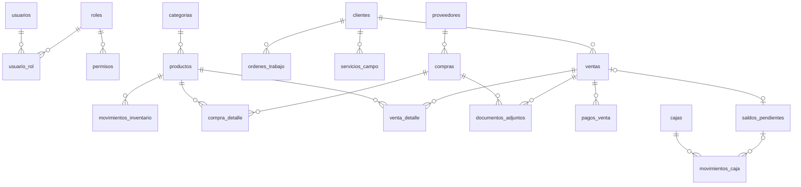
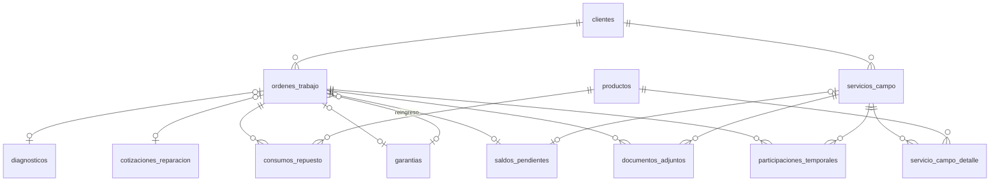

# Physical-Data-Model.md — Modelo Entidad-Relación Físico (PostgreSQL)

## 1. Propósito

Traduce [Conceptual-Data-Model.md](../01-Requirements/Conceptual-Data-Model.md), [Data-Dictionary.md](../01-Requirements/Data-Dictionary.md) y los patrones de [Architecture-Overview.md](../03-Architecture/Architecture-Overview.md) (sección 7) a un esquema físico concreto de PostgreSQL, listo para expresarse como migraciones de Entity Framework Core.

Ninguna tabla, columna o constraint aquí definida contradice una regla de negocio ya confirmada. Las decisiones puramente técnicas (tipos de dato, nombres de columnas, índices) se toman en este documento sin requerir nueva validación del propietario; donde una decisión física dependería de una regla de negocio aún no confirmada, se marca **[PV]**.

## 2. Convenciones físicas

| Aspecto | Decisión | Justificación |
|---|---|---|
| **Nombres de tablas y columnas** | `snake_case`, plural para tablas (`ordenes_trabajo`), singular para columnas (`fecha_recepcion`). | Convención estándar de PostgreSQL; evita tener que citar (`"..."`) identificadores en cada consulta SQL manual. Se usará el paquete **`EFCore.NamingConventions`** para que Entity Framework Core traduzca automáticamente las clases `PascalCase` de C# a `snake_case` en la base de datos, sin mapeo manual columna por columna. |
| **Claves primarias** | `uuid`, generadas con `gen_random_uuid()` (extensión `pgcrypto`, incluida en PostgreSQL моderno). | Permite generar IDs en el cliente sin round-trip al servidor — relevante para el punto de extensión ya documentado de una futura app móvil/offline para Servicios de Campo (RF-071), donde generar IDs localmente sin depender de un `SERIAL` autoincremental del servidor es una ventaja real, no especulativa. |
| **Fechas** | `timestamptz` para fecha+hora, `date` para solo fecha. | Evita ambigüedad de zona horaria. |
| **Montos** | `numeric(12,2)`. | Precisión exacta requerida para dinero (nunca `float`/`double`). |
| **Catálogos configurables** (el Administrador puede agregar valores sin migración) | **Tabla de referencia** propia (`medios_pago`, `categorias`, `roles`). | RN-028 (roles/permisos configurables) y CAT-008 (medios de pago "ampliable... sin cambios de arquitectura") exigen que estos valores se puedan agregar con un `INSERT`, no con una migración de esquema. |
| **Catálogos fijos** (estados de un flujo de negocio ya validado, no editables por el usuario) | `varchar` + restricción `CHECK`. | Los estados de una OT, Venta, Servicio de Campo, etc. son parte de una máquina de estados controlada por `Application` (RF-063, `Business-States.md`), no una lista que el Administrador deba poder editar libremente. Se prefiere `CHECK` sobre un `ENUM` nativo de PostgreSQL por ser más simple de modificar en una migración futura (consistente con el criterio de simplicidad de ADR-007/ADR-012). |
| **Baja lógica** | Columna `estado` (`'Activo'/'Inactivo'`) en vez de eliminar filas, en las entidades donde RN-023 exige preservar historial (Cliente, Proveedor, Usuario, Producto). | RN-023. |

## 3. Diagrama físico — Núcleo Comercial

## 4. Diagrama físico — Núcleo Técnico

## 5. Definición de tablas

### 5.1 Identidad y Acceso

**`usuarios`**
| Columna | Tipo | Restricciones |
|---|---|---|
| id | uuid | PK, default `gen_random_uuid()` |
| nombre | varchar(150) | NOT NULL — nombre completo, solo para mostrar |
| nombre_usuario | varchar(50) | NOT NULL, UNIQUE — campo de acceso (login), distinto de `nombre` (RN-036, **[PV]**) |
| credencial_hash | varchar(255) | NOT NULL — hash seguro (RNF-011), nunca texto plano |
| intentos_fallidos | int | NOT NULL, default `0` — RN-037, **[PV]** |
| bloqueado_hasta | timestamptz | NULL — RN-037, **[PV]** |
| estado | varchar(20) | NOT NULL, `CHECK (estado IN ('Activo','Inactivo'))`, default `'Activo'` |
| fecha_creacion | timestamptz | NOT NULL, default `now()` |

**`roles`** *(catálogo configurable — RN-028)*
| Columna | Tipo | Restricciones |
|---|---|---|
| id | uuid | PK |
| nombre | varchar(100) | NOT NULL, UNIQUE |
| descripcion | text | NULL |

**`permisos`**
| Columna | Tipo | Restricciones |
|---|---|---|
| id | uuid | PK |
| rol_id | uuid | NOT NULL, FK → `roles.id` |
| modulo | varchar(50) | NOT NULL |
| accion | varchar(20) | NOT NULL, `CHECK (accion IN ('Crear','Editar','Eliminar','Consultar','Anular'))` |
| | | `UNIQUE (rol_id, modulo, accion)` |

**`usuario_rol`** *(N:M — BQ-042)*
| Columna | Tipo | Restricciones |
|---|---|---|
| usuario_id | uuid | PK compuesta, FK → `usuarios.id` |
| rol_id | uuid | PK compuesta, FK → `roles.id` |

### 5.2 Terceros

**`clientes`**
| Columna | Tipo | Restricciones |
|---|---|---|
| id | uuid | PK |
| nombre_razon_social | varchar(200) | NOT NULL |
| tipo_documento | varchar(20) | NULL — **[PV] BQ-011**, valores propuestos: `'DNI','RUC','CE','Pasaporte'` |
| numero_documento | varchar(20) | NULL **[PV] BQ-011** |
| tipo_cliente | varchar(20) | NULL, `CHECK (tipo_cliente IN ('Natural','Juridica'))` **[PV] BQ-011** |
| telefono | varchar(30) | NOT NULL — RN-039 (confirmado 2026-07-19) |
| direccion | varchar(255) | NULL — opcional (RN-039) |
| estado | varchar(20) | NOT NULL, `CHECK (estado IN ('Activo','Inactivo'))`, default `'Activo'` — RN-023, baja lógica |

**`proveedores`**
| Columna | Tipo | Restricciones |
|---|---|---|
| id | uuid | PK |
| nombre_razon_social | varchar(200) | NOT NULL |
| documento | varchar(20) | NULL |
| telefono | varchar(30) | NULL |
| direccion | varchar(255) | NULL |
| estado | varchar(20) | NOT NULL, `CHECK (estado IN ('Activo','Inactivo'))`, default `'Activo'` |

### 5.3 Catálogo e Inventario

**`categorias`** *(catálogo configurable)*
| Columna | Tipo | Restricciones |
|---|---|---|
| id | uuid | PK |
| nombre | varchar(100) | NOT NULL |
| categoria_padre_id | uuid | NULL, FK → `categorias.id` — **[PV] BQ-007** (¿se requiere jerarquía?) |

**`unidades_medida`** *(catálogo configurable — CAT-014, resuelto por RN-040)*
| Columna | Tipo | Restricciones |
|---|---|---|
| id | uuid | PK |
| nombre | varchar(50) | NOT NULL, UNIQUE |

**`productos`**
| Columna | Tipo | Restricciones |
|---|---|---|
| id | uuid | PK |
| codigo_interno | varchar(50) | NOT NULL, UNIQUE — registro manual (RF-023) |
| codigo_barras | varchar(50) | NULL, UNIQUE si no nulo — opcional (BQ-056 resuelta) |
| nombre | varchar(200) | NOT NULL |
| categoria_id | uuid | NOT NULL, FK → `categorias.id` |
| marca | varchar(100) | NULL |
| unidad_medida_id | uuid | NOT NULL, FK → `unidades_medida.id` — RN-040 (BQ-008 resuelta) |
| costo_referencia | numeric(12,2) | NOT NULL, default `0` — costo de adquisición inicial; el recálculo por costo promedio ponderado (RN-013) se implementa en el módulo de Compras |
| precio_venta | numeric(12,2) | NOT NULL |
| stock_actual | numeric(12,3) | NOT NULL, default `0` — stock inicial capturado al registrar; el recálculo automático desde `movimientos_inventario` se implementa en el módulo de Inventario; `CHECK (stock_actual >= 0)` salvo ajuste autorizado (RN-008; ver nota) |
| stock_minimo | numeric(12,3) | NULL — RN-041 (BQ-005 parcialmente resuelta: campo capturado, sin lógica de alertas aún) |
| estado | varchar(20) | NOT NULL, `CHECK (estado IN ('Activo','Inactivo'))`, default `'Activo'` |

> **Nota sobre `stock_actual` y RN-008:** se mantiene como columna redundante (desnormalizada) por rendimiento de lectura (evita sumar todo el Kardex en cada consulta de stock — UC-11), recalculada transaccionalmente en cada `movimientos_inventario` insertado. El `CHECK (stock_actual >= 0)` se **desactiva únicamente** dentro de la transacción de un ajuste manual autorizado por el Administrador (RF-030); esto se controla a nivel de `Application`, no es posible expresar "excepto para un usuario" en un `CHECK` de PostgreSQL.

**`movimientos_inventario`** *(Kardex — ver Architecture-Overview.md §7.3)*
| Columna | Tipo | Restricciones |
|---|---|---|
| id | uuid | PK |
| producto_id | uuid | NOT NULL, FK → `productos.id` — **única FK fuerte de esta tabla** |
| tipo_movimiento | varchar(20) | NOT NULL, `CHECK (tipo_movimiento IN ('Compra','Venta','ConsumoTaller','ConsumoCampo','Ajuste','Devolucion'))` — CAT-013 |
| cantidad | numeric(12,3) | NOT NULL — positivo (entrada) o negativo (salida) |
| origen_tipo | varchar(20) | NULL, `CHECK (origen_tipo IN ('Compra','Venta','OrdenTrabajo','ServicioCampo') OR origen_tipo IS NULL)` — **sin FK declarativa** (decisión ADR-012) |
| origen_id | uuid | NULL — sin `FOREIGN KEY`; se resuelve por consulta aplicativa |
| motivo_ajuste | text | NULL — obligatorio a nivel de `Application` si `tipo_movimiento = 'Ajuste'` (RN-008) |
| usuario_id | uuid | NOT NULL, FK → `usuarios.id` — trazabilidad (RN-022) |
| fecha | timestamptz | NOT NULL, default `now()` |

*Índice recomendado:* `(producto_id, fecha)` para reconstruir el Kardex de un producto rápidamente.

### 5.4 Compras

**`compras`**
| Columna | Tipo | Restricciones |
|---|---|---|
| id | uuid | PK |
| proveedor_id | uuid | NOT NULL, FK → `proveedores.id` |
| fecha | date | NOT NULL |
| documento_compra_tipo | varchar(30) | NOT NULL |
| documento_compra_numero | varchar(50) | NOT NULL |
| usuario_id | uuid | NOT NULL, FK → `usuarios.id` |
| total | numeric(12,2) | NOT NULL, default `0` |

**`compra_detalle`**
| Columna | Tipo | Restricciones |
|---|---|---|
| id | uuid | PK |
| compra_id | uuid | NOT NULL, FK → `compras.id` |
| producto_id | uuid | NOT NULL, FK → `productos.id` |
| cantidad | numeric(12,3) | NOT NULL, `CHECK (cantidad > 0)` |
| costo_unitario | numeric(12,2) | NOT NULL |

### 5.5 Ventas

**`ventas`**
| Columna | Tipo | Restricciones |
|---|---|---|
| id | uuid | PK |
| cliente_id | uuid | NULL, FK → `clientes.id` — venta simple sin cliente registrado |
| tipo_comprobante | varchar(20) | NOT NULL, `CHECK (tipo_comprobante IN ('Cotizacion','Boleta','Factura','NotaVenta','Ticket'))` — CAT-004 |
| serie | varchar(10) | NULL — **[PV] BQ-050** |
| correlativo | integer | NULL **[PV] BQ-050** |
| origen | varchar(20) | NOT NULL, `CHECK (origen IN ('Directa','OrdenTrabajo','ServicioCampo'))`, default `'Directa'` — RF-083 |
| fecha | timestamptz | NOT NULL, default `now()` |
| usuario_id | uuid | NOT NULL, FK → `usuarios.id` |
| total | numeric(12,2) | NOT NULL, default `0` |
| estado | varchar(20) | NOT NULL, `CHECK (estado IN ('Registrada','Emitida','Pagada','Anulada'))`, default `'Registrada'` — **[PV] BQ-013** (reglas exactas de anulación) |

**`venta_detalle`**
| Columna | Tipo | Restricciones |
|---|---|---|
| id | uuid | PK |
| venta_id | uuid | NOT NULL, FK → `ventas.id` |
| producto_id | uuid | NOT NULL, FK → `productos.id` |
| cantidad | numeric(12,3) | NOT NULL, `CHECK (cantidad > 0)` |
| precio_unitario | numeric(12,2) | NOT NULL |

**`medios_pago`** *(catálogo configurable — CAT-008, resuelto)*
| Columna | Tipo | Restricciones |
|---|---|---|
| id | uuid | PK |
| nombre | varchar(50) | NOT NULL, UNIQUE |
| activo | boolean | NOT NULL, default `true` |

*Semilla inicial (RF-042):* `Efectivo`, `Yape`, `Plin`, `Transferencia bancaria`.

**`pagos_venta`**
| Columna | Tipo | Restricciones |
|---|---|---|
| id | uuid | PK |
| venta_id | uuid | NOT NULL, FK → `ventas.id` |
| medio_pago_id | uuid | NOT NULL, FK → `medios_pago.id` |
| monto | numeric(12,2) | NOT NULL, `CHECK (monto > 0)` |

### 5.6 Cobranzas *(módulo separado de Caja — ADR-012)*

**`saldos_pendientes`**
| Columna | Tipo | Restricciones |
|---|---|---|
| id | uuid | PK |
| venta_id | uuid | NULL, FK → `ventas.id` |
| orden_trabajo_id | uuid | NULL, FK → `ordenes_trabajo.id` |
| servicio_campo_id | uuid | NULL, FK → `servicios_campo.id` |
| monto_pendiente | numeric(12,2) | NOT NULL, `CHECK (monto_pendiente > 0)` |
| usuario_autorizo_id | uuid | NOT NULL, FK → `usuarios.id` — solo Administrador (validado en `Application`, no expresable como CHECK de fila) |
| fecha_referencia_pago | date | NULL |
| estado | varchar(20) | NOT NULL, `CHECK (estado IN ('Pendiente','Cobrado'))`, default `'Pendiente'` |
| | | `CHECK (` `(venta_id IS NOT NULL)::int + (orden_trabajo_id IS NOT NULL)::int + (servicio_campo_id IS NOT NULL)::int = 1` `)` — **exactamente un origen** (Architecture-Overview.md §7.1) |

### 5.7 Caja

**`cajas`**
| Columna | Tipo | Restricciones |
|---|---|---|
| id | uuid | PK |
| fecha_apertura | timestamptz | NOT NULL |
| monto_apertura | numeric(12,2) | NOT NULL — **[PV] BQ-030** (monto inicial exacto) |
| fecha_cierre | timestamptz | NULL |
| monto_teorico_cierre | numeric(12,2) | NULL — calculado |
| monto_fisico_declarado | numeric(12,2) | NULL — **[PV] BQ-031** |
| usuario_id | uuid | NOT NULL, FK → `usuarios.id` |
| estado | varchar(20) | NOT NULL, `CHECK (estado IN ('Abierta','Cerrada'))`, default `'Abierta'` |

**`movimientos_caja`** *(alcance reducido en la implementación — ver nota)*
| Columna | Tipo | Restricciones |
|---|---|---|
| id | uuid | PK |
| caja_id | uuid | NOT NULL, FK → `cajas.id` |
| tipo | varchar(10) | NOT NULL, `CHECK (tipo IN ('Ingreso','Egreso'))` |
| monto | numeric(12,2) | NOT NULL, `CHECK (monto > 0)` |
| concepto | varchar(30) | NOT NULL, `CHECK (concepto IN ('GastoOperativo','RetiroPropietario','AporteCapital'))` — RN-026, resuelve la parte estructural de BQ-088/BQ-030 (tipo de movimiento explícito) |
| descripcion | varchar(255) | NULL — texto libre opcional |
| usuario_id | uuid | NOT NULL, FK → `usuarios.id` |
| fecha | timestamptz | NOT NULL, default `now()` |

> **Nota (2026-07-19):** el diseño original de Fase 3 incluía además `venta_id`/`compra_id`/`orden_trabajo_id`/`servicio_campo_id`/`saldo_pendiente_id` (FK opcionales, Architecture-Overview.md §7.2) para vincular movimientos de caja a su origen transaccional. Se omiten en esta implementación porque los módulos de Ventas, Taller, Servicios de Campo y Cobranzas todavía no existen — declarar esas FK ahora apuntaría a tablas inexistentes. El módulo de Caja implementado cubre únicamente el registro **manual** (`concepto`, RN-026), que es lo que el propio `API-Design.md` describe como "egreso manual/gasto". Cada columna de origen se agregará (con su FK real) cuando el módulo correspondiente se construya, igual que `MovimientoInventario.origen_id` obtuvo su primer valor real (`compra_id`) solo cuando existió el módulo de Compras.
| | | `CHECK (` como máximo un origen no nulo entre venta/compra/orden_trabajo/servicio_campo/saldo_pendiente, o ninguno si `concepto_gasto` está presente `)` |

### 5.8 Taller

**`ordenes_trabajo`** *(3 columnas agregadas en la implementación — ver nota)*
| Columna | Tipo | Restricciones |
|---|---|---|
| id | uuid | PK |
| cliente_id | uuid | NOT NULL, FK → `clientes.id` — RN-004 |
| equipo_descripcion | varchar(255) | NOT NULL |
| falla_reportada | text | NOT NULL — **[PV] BQ-091** (campos exactos del recibo) |
| fecha_recepcion | timestamptz | NOT NULL, default `now()` |
| usuario_recepcion_id | uuid | NOT NULL, FK → `usuarios.id` — RN-029 |
| estado | varchar(20) | NOT NULL, `CHECK (estado IN ('Recibido','Diagnosticado','Cotizado','Aprobado','Rechazado','EnReparacion','EnPruebas','ListoParaEntrega','Entregado'))`, default `'Recibido'` |
| fecha_entrega | timestamptz | NULL |
| usuario_entrega_id | uuid | NULL, FK → `usuarios.id` |
| estado_pago | varchar(20) | NULL, `CHECK (estado_pago IN ('CompletoAntes','CompletoAlMomento','Adelanto','SaldoPendiente'))` — obligatorio al entregar (RN-001) |
| monto_pagado | numeric(12,2) | NULL — **agregada en la implementación (2026-07-20)**: RF-059 exige capturar el monto pagado al entregar, columna faltante en el diseño original |
| saldo_pendiente | numeric(12,2) | NULL — **agregada**: RN-001/RN-031 exige el monto pendiente cuando `estado_pago = 'SaldoPendiente'` |
| usuario_autorizo_saldo_id | uuid | NULL, FK → `usuarios.id` — **agregada**: RN-001/RN-031 exige el usuario Administrador/Propietario que autorizó el saldo pendiente |
| resultado_pruebas | text | NULL — **agregada**: RF-058, sin columna asignada en el diseño original |

**`diagnosticos`**
| Columna | Tipo | Restricciones |
|---|---|---|
| id | uuid | PK |
| orden_trabajo_id | uuid | NOT NULL, UNIQUE, FK → `ordenes_trabajo.id` — 1:1 |
| descripcion | text | NOT NULL |
| usuario_id | uuid | NOT NULL, FK → `usuarios.id` |
| fecha | timestamptz | NOT NULL, default `now()` |

**`cotizaciones_reparacion`**
| Columna | Tipo | Restricciones |
|---|---|---|
| id | uuid | PK |
| orden_trabajo_id | uuid | NOT NULL, UNIQUE, FK → `ordenes_trabajo.id` |
| monto_estimado | numeric(12,2) | NOT NULL |
| fecha | timestamptz | NOT NULL, default `now()` |
| decision_cliente | varchar(20) | NULL, `CHECK (decision_cliente IN ('Aprobada','Rechazada'))` |
| cobro_diagnostico_rechazo | numeric(12,2) | NULL — RN-030, solo si `decision_cliente = 'Rechazada'` |
| evidencia_aprobacion | varchar(255) | NULL — **[PV] BQ-034** (forma exacta) |

**`consumos_repuesto`**
| Columna | Tipo | Restricciones |
|---|---|---|
| id | uuid | PK |
| orden_trabajo_id | uuid | NOT NULL, FK → `ordenes_trabajo.id` |
| producto_id | uuid | NOT NULL, FK → `productos.id` |
| cantidad | numeric(12,3) | NOT NULL, `CHECK (cantidad > 0)` |

**`garantias`**
| Columna | Tipo | Restricciones |
|---|---|---|
| id | uuid | PK |
| orden_trabajo_id | uuid | NOT NULL, FK → `ordenes_trabajo.id` — OT que la generó |
| fecha_inicio | date | NOT NULL |
| fecha_fin | date | NOT NULL, `CHECK (fecha_fin > fecha_inicio)` |
| orden_trabajo_reingreso_id | uuid | NULL, FK → `ordenes_trabajo.id` |

### 5.9 Servicios de Campo

**`servicios_campo`**
| Columna | Tipo | Restricciones |
|---|---|---|
| id | uuid | PK |
| cliente_id | uuid | NOT NULL, FK → `clientes.id` |
| descripcion_trabajo | text | NOT NULL |
| fecha_solicitud | timestamptz | NOT NULL, default `now()` |
| tecnico_asignado_id | uuid | NULL, FK → `usuarios.id` — **[PV] BQ-037** |
| estado | varchar(20) | NOT NULL, `CHECK (estado IN ('Solicitado','Agendado','EnEjecucion','Cerrado'))`, default `'Solicitado'` |
| monto_estimado | numeric(12,2) | NULL — **agregada en la implementación (2026-07-20)**: RF-068 exige capturar el monto estimado al cotizar, columna faltante en el diseño original |
| fecha_ejecucion | timestamptz | NULL |
| estado_final | varchar(50) | NULL — RN-019 |
| observaciones | text | NULL |
| usuario_cierre_id | uuid | NULL, FK → `usuarios.id` |
| medio_pago_id | uuid | NULL, FK → `medios_pago.id` — **agregada**: RF-070 exige registrar el medio de pago del cobro |
| monto_pagado | numeric(12,2) | NULL — **agregada**: RF-070 exige capturar el monto pagado, columna faltante en el diseño original |
| saldo_pendiente | numeric(12,2) | NULL — **agregada**: RN-031 exige el monto pendiente cuando queda un saldo |
| usuario_autorizo_saldo_id | uuid | NULL, FK → `usuarios.id` — **agregada**: RN-031 exige el usuario Administrador/Propietario que autorizó el saldo pendiente |

**`servicio_campo_detalle`**
| Columna | Tipo | Restricciones |
|---|---|---|
| id | uuid | PK |
| servicio_campo_id | uuid | NOT NULL, FK → `servicios_campo.id` |
| producto_id | uuid | NOT NULL, FK → `productos.id` |
| cantidad | numeric(12,3) | NOT NULL, `CHECK (cantidad > 0)` |

**`participaciones_temporales`**
| Columna | Tipo | Restricciones |
|---|---|---|
| id | uuid | PK |
| orden_trabajo_id | uuid | NULL, FK → `ordenes_trabajo.id` |
| servicio_campo_id | uuid | NULL, FK → `servicios_campo.id` |
| nombre_trabajador | varchar(150) | NOT NULL |
| rol_apoyo | varchar(100) | NULL |
| | | `CHECK ((orden_trabajo_id IS NOT NULL)::int + (servicio_campo_id IS NOT NULL)::int = 1)` |

### 5.10 Transversales

**`documentos_adjuntos`**
| Columna | Tipo | Restricciones |
|---|---|---|
| id | uuid | PK |
| venta_id | uuid | NULL, FK → `ventas.id` |
| compra_id | uuid | NULL, FK → `compras.id` |
| orden_trabajo_id | uuid | NULL, FK → `ordenes_trabajo.id` |
| servicio_campo_id | uuid | NULL, FK → `servicios_campo.id` |
| tipo_documento | varchar(20) | NOT NULL, `CHECK (tipo_documento IN ('Foto','DocumentoCompra','Cotizacion','Comprobante','InformeTecnico'))` |
| archivo_ruta | varchar(500) | NOT NULL — ruta local (Architecture-Overview.md §10, `IAlmacenamientoArchivos`) |
| fecha | timestamptz | NOT NULL, default `now()` |
| usuario_id | uuid | NOT NULL, FK → `usuarios.id` |
| | | `CHECK (exactamente un origen no nulo entre venta/compra/orden_trabajo/servicio_campo)` |

**`auditoria`**
| Columna | Tipo | Restricciones |
|---|---|---|
| id | uuid | PK |
| usuario_id | uuid | NOT NULL, FK → `usuarios.id` |
| fecha_hora | timestamptz | NOT NULL, default `now()` |
| accion | varchar(30) | NOT NULL, `CHECK (accion IN ('Creacion','Modificacion','EliminacionLogica','Anulacion','MovimientoInventario','MovimientoCaja','CambioOT'))` — RF-078 |
| entidad_tipo | varchar(50) | NOT NULL — **sin FK declarativa**, registra cualquier entidad |
| entidad_id | uuid | NOT NULL |
| detalle | jsonb | NULL — **[PV] BQ-049** (nivel exacto: ¿solo acción, o también valores antes/después?) |

*Índice recomendado:* `(entidad_tipo, entidad_id)` para consultar el historial de un registro específico; `(usuario_id, fecha_hora)` para consultas por usuario/fecha (RF-079).

## 6. Resumen de constraints de exclusividad (patrón repetido)

Estas tres tablas comparten el mismo mecanismo — **exactamente un origen no nulo**, verificado con `CHECK` a nivel de PostgreSQL y reforzado con FluentValidation en `Application` (Architecture-Overview.md §7.1–7.2):

| Tabla | Orígenes posibles |
|---|---|
| `saldos_pendientes` | Venta, OrdenTrabajo, ServicioCampo |
| `participaciones_temporales` | OrdenTrabajo, ServicioCampo |
| `documentos_adjuntos` | Venta, Compra, OrdenTrabajo, ServicioCampo |

`movimientos_caja` usa una variante (como máximo uno, o ninguno con `concepto_gasto`), no exactamente uno, porque un gasto operativo directo no tiene ningún origen transaccional.

## 7. Índices recomendados (además de las PK/FK)

| Tabla | Índice | Motivo |
|---|---|---|
| `productos` | UNIQUE (`codigo_interno`) | Búsqueda rápida y evita duplicados (RF-023) |
| `productos` | UNIQUE (`codigo_barras`) *(parcial: `WHERE codigo_barras IS NOT NULL`)* | Idem, permitiendo múltiples NULL |
| `movimientos_inventario` | (`producto_id`, `fecha`) | Reconstrucción del Kardex (UC-11, RF-073) |
| `clientes` | (`numero_documento`) | Búsqueda de cliente (RF-015) — **[PV]** depende de BQ-011 |
| `ordenes_trabajo` | (`estado`) | Reportes y bandeja de trabajo por estado (RF-074) |
| `auditoria` | (`entidad_tipo`, `entidad_id`) | Consultar historial de un registro (RF-079) |
| `auditoria` | (`usuario_id`, `fecha_hora`) | Consultar por usuario/fecha (RF-079) |

## 8. Estrategia de migraciones

- Entity Framework Core Migrations (`dotnet ef migrations add ...`), una migración por cambio incremental de esquema, versionada en Git junto al código (`GIT_WORKFLOW.md`).
- Datos semilla (*seed data*) solo para catálogos ya confirmados: `medios_pago` (Efectivo, Yape, Plin, Transferencia bancaria — CAT-008), `unidades_medida` (Unidad, Metro, Kilogramo, Litro, Rollo, Par, Juego — CAT-014) y los 3 `roles` reales (Administrador, Ventas, Técnico — CAT-005). Ningún catálogo marcado **[PV]** en `Business-Catalogs.md` se precarga.

## 9. Lo que este documento NO resuelve todavía

Todo lo marcado **[PV]** arriba depende de una pregunta de `Business-Questions.md` sin responder (BQ-011, BQ-030, BQ-031, BQ-050, etc.). El esquema físico ya está preparado para incorporarlo (columnas nullable, tipos ya definidos) sin requerir un rediseño — solo activar restricciones adicionales (`NOT NULL`, valores de `CHECK`) cuando se confirmen.

## 10. Siguiente paso

Con el modelo físico definido, el siguiente entregable de la Fase 3 (`PROJECT_ROADMAP.md`) es el **Diseño de APIs** (contratos REST por módulo, en `05-Backend-API/`) y el **Diseño UI/UX** (`06-UI-UX/`), ambos derivables directamente de `Use-Cases.md` y de este modelo físico.
